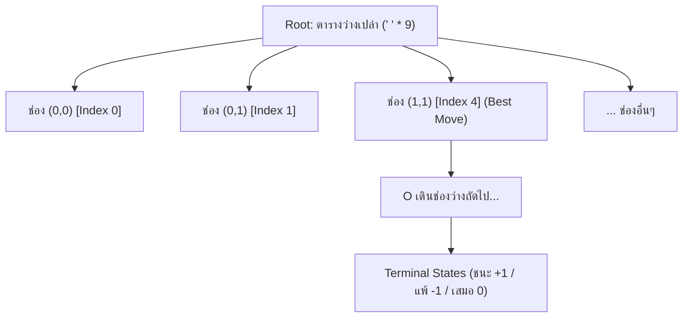

<p align="center">
  
</p>

<h1 align="center">เกม OX (Tic-Tac-Toe) ด้วย BFS Game Tree Algorithm</h1>

<p align="center">
  
  
  
</p>

เกม OX (Tic-Tac-Toe) บนตารางขนาด 3x3 พัฒนาด้วยภาษา **Python** ที่ขับเคลื่อนด้วย **Breadth-First Search (BFS) Game Tree Algorithm**

---

##  คุณสมบัติเด่น (Features)

1. **BFS Game Tree เต็มรูปแบบจาก State ว่างเปล่า**:
   - เริ่มต้นแตกกิ่งทั้งหมดตั้งแต่ Root ที่เป็นตารางว่างเปล่า 3x3 (`' ' * 9`)
   - แตกกิ่งแบบทีละระดับ (Level-by-Level) ด้วยคิว `collections.deque` (Queue-based FIFO)
   - ครอบคลุมสถานะที่เป็นไปได้ทั้งหมด **549,946 โหนด** และ **255,168 กิ่งผลลัพธ์ (Leaves)** ในเวลาเพียง ~1 วินาที
2. **ระบบให้คะแนนตามกิ่ง (Branch Scoring)**:
   - **ชนะ (Win)**: $+1$
   - **แพ้ (Loss)**: $-1$
   - **เสมอ (Draw)**: $0$
   - **คะแนนรวมของกิ่ง (Branch Score)**:
     $$\text{Score} = (\text{Wins} \times +1) + (\text{Losses} \times -1) + (\text{Draws} \times 0)$$
   - พร้อมแสดงอัตราการชนะ (Win Rate %) และค่า Minimax
3. **Live DEBUG ละเอียดใน Turn ของ AI**:
   - พิมพ์ลงทั้ง **Terminal Console (stdout)** และแสดงใน **GUI Live Debug Console** เมื่อถึงตาของบอท BFS
   - แสดงรายการกิ่งที่เป็นไปได้ทั้งหมดในสถานะปัจจุบัน
   - สรุปสถิติกิ่งชนะ กิ่งแพ้ กิ่งเสมอ คะแนนรวม และรูปตารางพรีวิวของแต่ละกิ่ง
   - ไฮไลต์กิ่งที่ดีที่สุดที่ AI เลือกเดิน
4. **ส่วนติดต่อผู้ใช้กราฟิก (Tkinter GUI)**:
   - ดีไซน์สวยงาม ทันสมัย ใช้งานง่าย
   - โหมดการเล่น:  ผู้เล่น (X) vs  บอท BFS (O)
   - ขยายตารางเล่นเกมกว้างประมาณ 40% ของหน้าต่าง พร้อมล็อคขนาดช่องตารางไม่ให้เลื่อนขยับ
   - ไฮไลต์เส้นที่ชนะ (Winning line)
   - ปุ่ม Copy Log และ Clear Log

---

##  โครงสร้างไฟล์ในโปรเจกต์

```
d:/OX-BFS/
│
├── assets/             # SVG icons สำหรับแสดงผลบน GitHub
│   ├── bot.svg
│   ├── code.svg
│   ├── cpu.svg
│   ├── folder.svg
│   ├── gamepad.svg
│   ├── rocket.svg
│   ├── star.svg
│   └── user.svg
├── ox_bfs_engine.py    # Core Engine: โครงสร้าง BFS Game Tree, คิว และการคำนวณคะแนน
├── ox_debug.py         # Debug Formatter: จัดรูปแบบข้อความ DEBUG และพรีวิวตาราง ASCII
├── gui.py              # หน้าต่างกราฟิก Tkinter และระบบจัดการ Event
├── main.py             # จุดเริ่มต้นรันโปรแกรม
└── README.md           # เอกสารอธิบายการใช้งานและหลักการอัลกอริทึม
```

---

##  วิธีการติดตั้งและเปิดใช้งาน (How to Run)

โปรเจกต์นี้ใช้ไลบรารีมาตรฐานของ Python ทั้งหมด (`tkinter`, `collections`) ไม่จำเป็นต้องติดตั้งไลบรารีภายนอกเพิ่มเติม

```bash
python main.py
```

---

##  หลักการทำงานของอัลกอริทึม BFS Game Tree



1. **Breadth-First Expansion**:
   นำโหนดใส่ `deque` และดึงออกมาทีละตัวเพื่อแตกกิ่งไปยังช่องที่ยังว่างอยู่ (`' '`) เมื่อพบสถานะสิ้นสุด (Terminal State) จะหยุดแตกกิ่งในสายนั้น
2. **Bottom-Up Reverse BFS Score Propagation**:
   เมื่อประมวลผล BFS เสร็จสิ้น จะย้อนลำดับจากโหนดปลายทางกลับขึ้นมาสู่ Root:
   - นับผลรวมของกิ่งลูก: $\text{Wins}$, $\text{Losses}$, $\text{Draws}$
   - คำนวณค่า Minimax เพื่อการันตีการเล่นที่ไม่เพลี่ยงพล้ำ
3. **การเลือกตาเดินของ AI (Decision Strategy)**:
   - **Direct Win**: หากมีตาเดินที่ทำให้ชนะทันที จะเลือกเดินทันที
   - **Direct Block**: หากคู่ต่อสู้มีโอกาสชนะในตาถัดไป จะต้องบล็อกทันที
   - **Optimal Branch Selection**: เลือกกิ่งที่มี Minimax ดีที่สุด และมีคะแนนผลรวมกิ่ง (Branch Score) สูงที่สุด

---

##  คำอธิบายการทำงานของแต่ละฟังก์ชัน (Function Explanations)

### 1. ไฟล์ `ox_bfs_engine.py` (แกนกลางระบบและ Breadth-First Search)

โมดูลหลักในการสร้างและค้นหาผ่าน BFS Game Tree ทั้งหมด 549,946 โหนด:

- **ฟังก์ชันระดับโมดูล**:
  - `get_opponent(player)`: คืนค่าสัญลักษณ์ของคู่แข่ง (ถ้าส่ง `'X'` จะคืน `'O'`, ถ้าส่ง `'O'` จะคืน `'X'`)
  - `place_symbol(board, position, player)`: วางสัญลักษณ์ของผู้เล่นลงในตำแหน่งที่ระบุ (ช่อง 0-8) และคืนสตริงกระดานชุดใหม่
  - `check_board_winner(board)`: ตรวจสอบสถานะแพ้/ชนะ/เสมอ จากชุดคอมโบ 8 เส้นที่กำหนดไว้ใน `WINNING_COMBOS` (3 แนวนอน, 3 แนวตั้ง, 2 แนวทแยง) โดยคืนค่าเป็น `'X'`, `'O'`, `'Draw'` (กรณีเต็มกระดานและไม่มีผู้ชนะ), หรือ `None` (เกมยังไม่จบ)

- **คลาส `GameNode` (โครงสร้างข้อมูลแต่ละโหนดใน Game Tree)**:
  - `__init__(self, board, player_turn, move, depth)`: กำหนดค่าเริ่มต้นของโหนด ได้แก่ ตารางปัจจุบัน, ตาเดินของผู้เล่น, ช่องที่เดินเข้ามา, ระดับความลึก (depth), ลิสต์กิ่งลูก (`children`), ตรวจสอบสถานะจบเกม (`is_terminal`), เก็บสถิติกิ่งปลายทาง (`wins_x`, `wins_o`, `draws`), และค่า Minimax (`minimax_val`)

- **คลาส `OXBFSTree` (การสร้างและประเมินผลกิ่ง BFS)**:
  - `__init__(self)`: กำหนดค่าเริ่มต้นตัวแปร และสั่งสร้าง Game Tree ทันทีเมื่อออบเจกต์ถูกสร้างขึ้น
  - `_build_tree(self)`: สร้าง BFS Game Tree ทั้งหมด 549,946 โหนด โดยใช้ Queue (`collections.deque`) เริ่มต้นจากตารางว่างเปล่า `' ' * 9` แตกกิ่งทีละระดับ (FIFO) จากนั้นใช้ลูปย้อนกลับ (`reversed`) เพื่อรวมผลสถิติจำนวนกิ่งชนะ/แพ้/เสมอ และคำนวณค่า Minimax ส่งต่อขึ้นมาสู่ Root
  - `get_node(self, board, player_turn)`: ค้นหาและดึงโหนดจาก `state_map` ตามสถานะตารางและตาเดิน
  - `evaluate_branches(self, current_board, current_player)`: ประเมินกิ่งทางเลือกทั้งหมดจากสถานะปัจจุบัน คำนวณคะแนนกิ่ง (Branch Score) อัตราการชนะ และเลือกตาเดินที่ดีที่สุด (`best_move`) โดยใช้กลยุทธ์:
    1. เดินแล้วชนะทันที -> เลือกเดินทันที
    2. คู่แข่งกำลังจะชนะ -> เดินบล็อกทันที
    3. เลือกกิ่งที่มีค่า Minimax สูงที่สุด
    4. หากมีหลายกิ่ง ให้เลือกกิ่งที่มีคะแนนรวมสูงสุด
  - `get_debug_text(self, current_board, current_player, turn_number, chosen_move)`: เรียกใช้งานฟังก์ชันจากโมดูล `ox_debug` เพื่อสร้างข้อความสรุปผลการวิเคราะห์กิ่ง

---

### 2. ไฟล์ `ox_debug.py` (ระบบจัดรูปแบบข้อความ DEBUG)

โมดูลช่วยจัดรูปแบบข้อความรายงานผลการวิเคราะห์กิ่งให้อ่านง่ายและเป็นระเบียบ:

- `format_row(board, start_index)`: จัดรูปแบบการแสดงผล 3 ช่องในแถวที่กำหนด เช่น `. | X | .`
- `get_branch_score(branch)`: ดึงค่าคะแนนของกิ่ง (`branch['score']`) เพื่อใช้เป็นคีย์สำหรับจัดเรียงลำดับกิ่งที่ดีที่สุด
- `get_debug_text(tree, current_board, current_player, turn_number, chosen_move)`: สร้างข้อความรายงานผล DEBUG ละเอียดประจำเทิร์น ประกอบด้วย:
  - สถานะกระดานปัจจุบัน 3x3
  - รายการกิ่งทางเลือกทั้งหมด เรียงลำดับจากคะแนนสูงสุด พร้อมสัญลักษณ์ `[BEST MOVE]`
  - ผลวิเคราะห์ Minimax (การันตีชนะ, เสมอ, หรืออาจพ่ายแพ้)
  - รูปภาพ Preview ตาราง 3 บรรทัดของแต่ละกิ่ง
  - สรุปตาเดินที่ AI ตัดสินใจเลือก

---

### 3. ไฟล์ `gui.py` (ส่วนติดต่อผู้ใช้กราฟิก Tkinter)

โมดูลควบคุมหน้าต่างโปรแกรม การโต้ตอบกับผู้เล่น และการเรนเดอร์ภาพ:

- `place_symbol(board, position, player)`: ฟังก์ชันช่วยวางสัญลักษณ์ลงในสตริงกระดาน
- **คลาส `OXGameGUI`**:
  - `__init__(self, root)`: กำหนดค่าหน้าต่างหลัก Tkinter (1180x740), ค่าสี, ตัวแปรสถานะเกม, และเรียกโหลดระบบ
  - `_init_engine(self)`: สั่งโหลดและสร้างออบเจกต์ `OXBFSTree`
  - `_create_widgets(self)`: สร้างและจัดวางวิดเจ็ตทั้งหมด แบ่งสัดส่วน 40:60 ด้วย Grid Uniform:
    - ส่วนบน: Header แถบหัวข้อ พร้อมปุ่มกดเริ่มเกมใหม่ (Restart)
    - ฝั่งซ้าย (~40%): ข้อมูลผู้เล่น, สกอร์บอร์ดคะแนน, ป้ายแจ้งสถานะเทิร์น, และกระดานปุ่ม 3x3 (ล็อคขนาดด้วย `uniform="cell"`)
    - ฝั่งขวา (~60%): หน้าต่าง Live DEBUG Console พร้อม Scrollbar และปุ่ม Copy/Clear Log
  - `_append_debug_log(self, text)`: แสดงข้อความลงในช่อง Text Box ของหน้าต่าง Debug และพิมพ์ออกทาง Terminal Console
  - `_clear_debug_log(self)`: ล้างข้อความทั้งหมดในหน้าต่าง Debug
  - `_copy_debug_log(self)`: คัดลอกข้อความในหน้าต่าง Debug ไปยัง Clipboard ของระบบ
  - `start_new_game(self)`: รีเซ็ตกระดานเป็นช่องว่าง ล้างข้อความ Debug คืนค่าปุ่มทั้ง 9 ช่อง และเริ่มรอบใหม่
  - `_update_status(self, text, is_over)`: อัปเดตข้อความและสีพื้นหลังของแถบสถานะ (เช่น ตาเดินของคุณ, บอทกำลังคิด, หรือแจ้งผู้ชนะ)
  - `_update_scoreboard(self)`: อัปเดตตัวเลขคะแนนบนสกอร์บอร์ด (ผู้เล่น X, บอท O, เสมอ)
  - `_highlight_winning_line(self, combo)`: ไฮไลต์เปลี่ยนสีพื้นหลังของ 3 ช่องที่ชนะเรียงเป็นเส้น
  - `_check_game_end(self)`: ตรวจสอบการจบเกม (ชนะหรือเสมอ) บันทึกคะแนน และแสดงผลลัพธ์
  - `_on_cell_clicked(self, idx)`: จัดการเหตุการณ์เมื่อผู้เล่นคลิกช่องบนกระดาน ตรวจสอบความถูกต้องและส่งต่อคำสั่ง
  - `_execute_move(self, move_idx)`: ดำเนินการวางหมาก บันทึกข้อความ DEBUG (เฉพาะในตาของบอท AI) อัปเดตปุ่ม และสลับเทิร์น
  - `_ai_turn(self)`: ตาเดินของบอท AI เรียกให้อัลกอริทึม BFS วิเคราะห์กิ่งที่ดีที่สุดและเดินหมากอัตโนมัติ

---

### 4. ไฟล์ `main.py` (จุดเริ่มต้นการรันโปรแกรม)

- `main()`: ฟังก์ชันหลักสำหรับสร้างหน้าต่าง `tk.Tk()`, ผูกเข้ากับคลาส `OXGameGUI`, และเริ่ม Event Loop ด้วย `root.mainloop()` เพื่อเปิดหน้าต่างเกมขึ้นมาทันที
