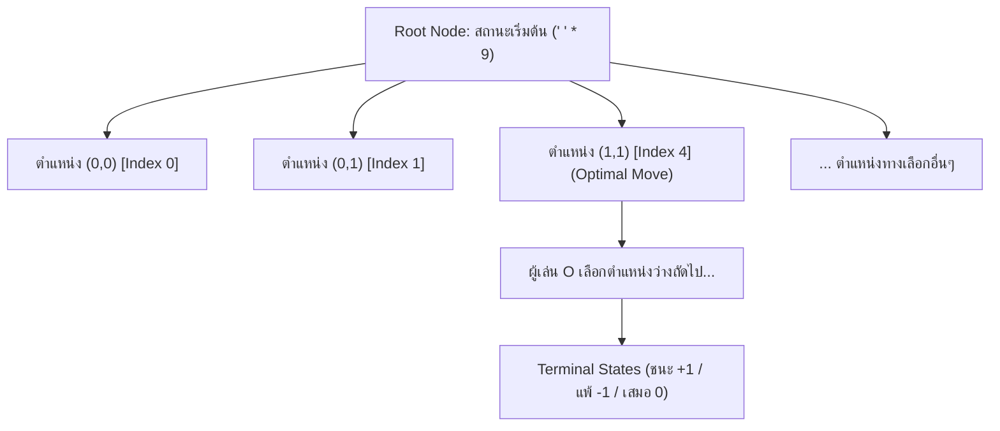

<p align="center">
  
</p>

<h1 align="center">ระบบเกม OX (Tic-Tac-Toe) ด้วยขั้นตอนวิธี Breadth-First Search (BFS) Game Tree</h1>

<p align="center">
  
  
  
</p>

โครงการพัฒนาระบบเกม OX (Tic-Tac-Toe) ขนาดตาราง 3×3 ด้วยภาษา **Python** ขับเคลื่อนด้วยขั้นตอนวิธี **Breadth-First Search (BFS) Game Tree** ร่วมกับ **Minimax Algorithm** เพื่อการวิเคราะห์ปริภูมิสถานะทั้งหมดของเกม (Exhaustive State Space Analysis) และการตัดสินใจเชิงกลยุทธ์ของปัญญาประดิษฐ์ (AI) อย่างสมบูรณ์และแม่นยำ

---

##  คุณลักษณะสำคัญของระบบ (System Features)

1. **การสำรวจปริภูมิสถานะอย่างครบถ้วน (Exhaustive State Space Exploration via BFS)**:
   - ประมวลผลและสร้างต้นไม้สถานะของเกม (Game Tree) จากสถานะเริ่มต้นที่เป็นกระดานว่างเปล่า (`' ' * 9`)
   - สำรวจและขยายกิ่งสถานะทีละระดับความลึก (Level-by-Level Traversal) ด้วยโครงสร้างข้อมูลแถวคอย (Queue-based FIFO) ผ่าน `collections.deque`
   - ครอบคลุมสถานะที่เป็นไปได้ทั้งหมดในระบบจำนวน **549,946 โหนด** และโหนดปลายทาง (Terminal States / Leaves) จำนวน **255,168 โหนด**
2. **การประเมินและการถ่ายทอดค่าคะแนน (Heuristic Scoring & Minimax Value Propagation)**:
   - กำหนดเกณฑ์ผลลัพธ์การแข่งขันตามหลักทฤษฎีเกม:
     - ชนะ (Win): $+1$
     - แพ้ (Loss): $-1$
     - เสมอ (Draw): $0$
   - คำนวณคะแนนรวมของกิ่งสถานะ (Branch Score):
     $$\text{Score} = (\text{Wins} \times +1) + (\text{Losses} \times -1) + (\text{Draws} \times 0)$$
   - แสดงผลอัตราส่วนความน่าจะเป็นในการชนะ (Win Rate Percentage) ควบคู่กับค่า Minimax
3. **ระบบวิเคราะห์และการตัดสินใจแบบเรียลไทม์ (Real-Time Decision Analysis Console)**:
   - รายงานผลผ่านทั้ง Terminal Standard Output (stdout) และ Live Debug Console บนส่วนติดต่อผู้ใช้เชิงกราฟิกในเทิร์นของ AI
   - แจกแจงรายการกิ่งทางเลือกที่เป็นไปได้ทั้งหมดจากสถานะปัจจุบัน
   - สรุปข้อมูลสถิติจำนวนกิ่งที่นำไปสู่ชัยชนะ ความพ่ายแพ้ และการเสมอ พร้อมแสดงภาพจำลองกระดาน (Board Preview) ของแต่ละทางเลือก
   - ไฮไลต์ระบุตาเดินที่เหมาะสมที่สุด (Optimal Move) ตามเกณฑ์ Minimax
4. **ส่วนติดต่อผู้ใช้เชิงกราฟิก (Graphical User Interface - Tkinter GUI)**:
   - โครงสร้างการแสดงผลแบบโมเดิร์น สัดส่วนการใช้งานมีความชัดเจนและเป็นระเบียบ
   - โหมดการแข่งขัน:  ผู้เล่น (Player X) ดำเนินการแข่งขันกับ  ปัญญาประดิษฐ์ (BFS Bot O)
   - จัดสรรสัดส่วนหน้าต่างระหว่างกระดานเกมและแผงรายงานผลอย่างเป็นสัดส่วน (40:60) พร้อมกำหนดขนาดช่องตารางแบบคงที่ (Fixed Grid Cell Constraints)
   - แสดงผลไฮไลต์เส้นที่ชนะ (Winning Combination Line) เมื่อสิ้นสุดการแข่งขัน

---

##  โครงสร้างไฟล์ในโครงการ (Project Architecture)

```
drive:/OX-BFS/
│
├── core_bfs.py         # แกนประมวลผลหลัก (Core BFS Engine): โครงสร้าง Game Tree, คิว และการวิเคราะห์ Minimax
├── ox_debug.py         # มอดูลจัดรูปแบบข้อมูลแสดงผล (Debug Formatter): จัดทำรายงานการวิเคราะห์และภาพจำลองตาราง
├── gui.py              # ส่วนติดต่อผู้ใช้เชิงกราฟิก (Tkinter GUI): การแสดงผล การรับเหตุการณ์ และการโต้ตอบ
├── main.py             # จุดเริ่มต้นการทำงานของระบบ (Application Entry Point)
├── .gitignore          # รายการไฟล์และโฟลเดอร์ที่ไม่จัดเก็บในระบบควบคุมเวอร์ชัน Git
└── README.md           # เอกสารทางเทคนิคอธิบายสถาปัตยกรรมระบบ ขั้นตอนวิธี และคู่มือการใช้งาน
```

---

##  ข้อกำหนดระบบและการเริ่มต้นใช้งาน (System Requirements & Execution)

โครงการนี้พัฒนาขึ้นโดยใช้ไลบรารีมาตรฐานของภาษา Python ทั้งหมด (`tkinter`, `collections`) โดยไม่มีการพึ่งพาไลบรารีภายนอก (Zero External Dependencies)

- **ข้อกำหนดของระบบ**: Python เวอร์ชัน 3.8 หรือสูงกว่า
- **คำสั่งเริ่มต้นการทำงาน**:

```bash
python main.py
```

---

##  สถาปัตยกรรมขั้นตอนวิธี (Algorithmic Architecture)



การทำงานของขั้นตอนวิธีแบ่งออกเป็น **2 ขั้นตอนหลัก**:

### ขั้นตอนที่ 1: การประมวลผลล่วงหน้าเพื่อสร้าง Game Tree (Precomputation Phase)

1. **Breadth-First Expansion (การสำรวจตามแนวกว้างด้วยโครงสร้างแถวคอยแบบ FIFO)**:
   - กำหนดให้ Root Node เป็นกระดานว่างเปล่า `' ' * 9` บรรจุเข้าสู่โครงสร้างข้อมูลแถวคอย `collections.deque` ผ่านเมธอด `append`
   - เรียกใช้ `popleft()` เพื่อดึงโหนดจากส่วนหัวของแถวคอย ส่งผลให้การขยายโหนดเป็นไปตามลำดับระดับความลึก (Level-Order Traversal) จากระดับ $0 \to 1 \to 2 \to \dots \to 9$ อย่างเป็นลำดับ
   - สำหรับแต่ละโหนด ระบบจะจำลองการวางหมากในทุกตำแหน่งที่ยังว่าง (`' '`) เพื่อสร้างโหนดลูกในระดับความลึกถัดไป ($d+1$) และนำเข้าสู่ส่วนท้ายของแถวคอย
   - เมื่อตรวจพบสถานะสิ้นสุดการแข่งขัน (Terminal State: มีผู้ชนะหรือผลเสมอ) ระบบจะระงับการขยายกิ่งสถานะต่อ (Pruning) และจัดประเภทโหนดดังกล่าวเป็นโหนดปลายทาง (Leaf Node)
   - ครอบคลุมปริภูมิสถานะของเกมทั้งสิ้น **549,946 โหนด** และมีโหนดปลายทาง **255,168 โหนด**
2. **State Caching via Hash Table**:
   - ระหว่างการประมวลผล BFS ทุกโหนดจะถูกบันทึกลงในโครงสร้างพจนานุกรม `state_map[(board, player_turn)]`
   - ทำหน้าที่เป็นทั้ง Visited Set และ Lookup Table เพื่อให้การค้นหาสถานะในขณะเล่นเกม (Runtime) มีความซับซ้อนเชิงเวลาอยู่ในระดับ $O(1)$
3. **Bottom-Up Backward Propagation (การถ่ายทอดค่าคะแนนย้อนกลับตามลำดับย้อนกลับของ BFS)**:
   - ด้วยคุณสมบัติของ BFS โหนดบรรพบุรุษจะถูกบันทึกลงในลิสต์ `all_nodes` ก่อนโหนดลูกเสมอ ดังนั้นการวนลูปย้อนกลับผ่าน `reversed(all_nodes)` จึงรับประกันได้ว่าโหนดลูกจะได้รับการประมวลผลเสร็จสิ้นก่อนโหนดแม่เสมอ (Reverse Topological Order)
   - กำหนดค่าให้กับโหนดปลายทาง: ชัยชนะของผู้เล่น X กำหนดค่า $+1$, ชัยชนะของผู้เล่น O กำหนดค่า $-1$, และผลเสมอ กำหนดค่า $0$ จากนั้นสะสมผลรวมจำนวนกิ่ง (`wins_x`, `wins_o`, `draws`) ถ่ายทอดขึ้นสู่โหนดระดับบน
   - คำนวณค่า Minimax ของแต่ละโหนด: ใช้ฟังก์ชัน $\max()$ ในเทิร์นของผู้เล่น X และใช้ฟังก์ชัน $\min()$ ในเทิร์นของผู้เล่น O

### ขั้นตอนที่ 2: การประเมินผลและการตัดสินใจเชิงกลยุทธ์ (Runtime Decision Phase)

ระบบไม่ต้องสร้าง Game Tree ขึ้นใหม่ในระหว่างการเล่น แต่จะค้นหาสถานะปัจจุบันผ่าน `state_map` แล้วใช้กฎการตัดสินใจตามลำดับชั้นความสำคัญ (Hierarchical Decision Rules):

1. **การคว้าชัยชนะทันที (Direct Win)**: หากมีตาเดินที่นำไปสู่ผลลัพธ์ชนะทันทีในเทิร์นนั้น ระบบจะเลือกเดินในตำแหน่งดังกล่าวทันที
2. **การสกัดกั้นเชิงรุก (Direct Block)**: หากคู่ต่อสู้มีโอกาสชนะในตาถัดไป ระบบจะเลือกเดินเพื่อสกัดกั้นทันที
3. **การคัดเลือกตามทฤษฎีเกม (Optimal Minimax Selection)**: เลือกกิ่งสถานะที่มีค่า Minimax สูงที่สุด เพื่อรับประกันผลลัพธ์ที่ดีที่สุดภายใต้กลยุทธ์ที่สมบูรณ์ (Optimal Play)
4. **การเพิ่มประสิทธิภาพคะแนนสะสม (Branch Score Maximization)**: กรณีมีกิ่งสถานะที่ให้ค่า Minimax สูงสุดเท่ากันหลายกิ่ง ระบบจะเลือกกิ่งที่มีคะแนนสะสมของผลลัพธ์รวม (Branch Score) สูงที่สุด

---

##  เอกสารอ้างอิงฟังก์ชันและโครงสร้างข้อมูล (Function & Class Reference)

### 1. มอดูล `core_bfs.py` (แกนประมวลผลหลัก BFS Game Tree)

มอดูลหลักในการสร้าง จัดการ และค้นหาโครงสร้าง BFS Game Tree:

- **ค่าคงที่ของระบบ (Constants)**:
  - `WINNING_COMBOS`: ทูเพิลกำหนดชุดดัชนีของเส้นชัยชนะทั้ง 8 รูปแบบ (3 แนวนอน, 3 แนวตั้ง, 2 แนวทแยง) สำหรับกระดานขนาด 3×3
- **ฟังก์ชันระดับมอดูล (Module-Level Functions)**:
  - `get_opponent(player)`: แปลงสัญลักษณ์เพื่อระบุผู้เล่นฝ่ายตรงข้าม (`'X'` $\leftrightarrow$ `'O'`)
  - `swap_symbols(board)`: ดำเนินการแปลงสัญลักษณ์กระดานแบบสมมาตร (Symmetric Transformation) ระหว่าง X และ O ผ่านตารางแปลงอักขระ (`str.maketrans`) เพื่อค้นหาสถานะเทียบเท่าใน `state_map`
  - `place_symbol(board, position, player)`: สร้างสตริงสถานะกระดานชุดใหม่แบบคงรูป (Immutable State Transition) หลังการวางหมากในตำแหน่งที่กำหนด
  - `check_board_winner(board)`: ตรวจสอบและประเมินผลลัพธ์การแข่งขันตามเงื่อนไขของ `WINNING_COMBOS` โดยส่งคืนค่าเป็น `'X'`, `'O'`, `'Draw'` หรือ `None` (กรณียังไม่สิ้นสุด)
- **คลาส `GameNode` (โครงสร้างข้อมูลแทนโหนดสถานะ)**:
  - `__init__(board, player_turn, move, depth)`: กำหนดค่าเริ่มต้นของโหนด ได้แก่ สถานะกระดาน (`board`), ลำดับผู้เล่น (`player_turn`), ตำแหน่งการเดินที่นำมาสู่สถานะนี้ (`move`), ระดับความลึก (`depth`), ลิสต์โหนดลูก (`children`), และสถานะการสิ้นสุด (`is_terminal`)
  - ตัวแปรสถิติสะสม: `wins_x`, `wins_o`, `draws`, และค่าประเมินเชิงทฤษฎีเกม `minimax_val`
- **คลาส `OXBFSTree` (การบริหารจัดการโครงสร้างต้นไม้และการตัดสินใจ)**:
  - `__init__()`: กำหนดค่าเริ่มต้นตัวแปร และสั่งประมวลผลฟังก์ชัน `_build_tree()` เพื่อเตรียมพร้อมระบบ
  - `_build_tree()`: ดำเนินขั้นตอนวิธี BFS สร้าง Game Tree ทั้งหมด 549,946 โหนด พร้อมประมวลผลค่าย้อนกลับแบบ Bottom-Up
  - `get_node(board, player_turn)`: ค้นหาและส่งคืนออบเจกต์โหนดจาก `state_map` ด้วยความซับซ้อนเชิงเวลาระดับ $O(1)$
  - `evaluate_branches(current_board, current_player)`: ประเมินกิ่งทางเลือกทั้งหมดจากสถานะปัจจุบัน ดึงสถิติ BFS แปลงมุมมองคะแนน และคัดเลือกตาเดินที่เหมาะสมที่สุด (`best_move`)
  - `get_debug_text(...)`: ส่งต่อข้อมูลสถานะปัจจุบันให้แก่มอดูล `ox_debug` เพื่อจัดทำรายงานการวิเคราะห์

---

### 2. มอดูล `ox_debug.py` (ระบบจัดรูปแบบรายงานการวิเคราะห์)

มอดูลสนับสนุนด้านการจัดรูปแบบข้อมูลเชิงสถิติและการแสดงผล:

- `format_row(board, start_index, size)`: จัดรูปแบบอักขระในแถวของกระดานให้แสดงผลอย่างเป็นระเบียบ เช่น `. | X | .`
- `get_branch_score(branch)`: ฟังก์ชันคีย์สำหรับส่งคืนค่าคะแนนของกิ่งสถานะ (`branch['score']`) เพื่อใช้ในการจัดเรียงลำดับ
- `get_debug_text(tree, current_board, current_player, turn_number, chosen_move=None)`: สร้างรายงานสรุปผลการวิเคราะห์กิ่งทางเลือก Minimax ละเอียดประจำเทิร์น พร้อมภาพจำลองกระดานในรูปแบบ ASCII

---

### 3. มอดูล `gui.py` (ส่วนติดต่อผู้ใช้เชิงกราฟิก Tkinter)

มอดูลบริหารจัดการหน้าต่างโปรแกรม การรับเหตุการณ์ และการเรนเดอร์องค์ประกอบภาพ:

- **คลาส `OXGameGUI`**:
  - `__init__(root)`: กำหนดค่าคอนฟิกูเรชันหน้าต่างหลัก ขนาดหน้าจอ (1180×740 พิกเซล), ธีมสี, ตัวแปรสถานะ และสั่งเตรียมระบบผ่าน `_init_engine()`
  - `_init_engine()`: สร้างอินสแตนซ์ของ `OXBFSTree` เพื่อเริ่มกระบวนการ Precompute
  - `_create_widgets()`: จัดสรรโครงร่างหน้าต่างออกเป็นสัดส่วน 40:60 ประกอบด้วยแถบหัวข้อ, กระดานปุ่ม 3×3 (กำหนดสัดส่วนคงที่ด้วย `uniform="cell"`), และคอนโซลแสดงผลการวิเคราะห์
  - `_on_cell_clicked(idx)`: ตัวจัดการเหตุการณ์ (Event Handler) เมื่อผู้เล่นคลิกเลือกตำแหน่งบนกระดาน
  - `_execute_move(move_idx)`: ดำเนินการวางหมาก บันทึกรายงานการวิเคราะห์ สลับลำดับผู้เล่น และตรวจสอบสถานะจบเกม
  - `_ai_turn()`: ประมวลผลและดำเนินการเดินหมากของปัญญาประดิษฐ์อัตโนมัติตามผลลัพธ์ของ BFS Tree
  - `start_new_game()`: รีเซ็ตสถานะกระดาน ล้างคอนโซลรายงาน และปรับปรุงสถานะปุ่มทั้ง 9 ช่องเพื่อเริ่มการแข่งขันใหม่
  - `_update_status(text, is_over)`: ปรับปรุงข้อความและชุดสีบนแถบสถานะการแข่งขัน
  - `_update_scoreboard()`: ปรับปรุงข้อมูลสถิติผลการแข่งขันบนกระดานคะแนน
  - `_highlight_winning_line(combo)`: ปรับเปลี่ยนสีพื้นหลังของชุดช่องตารางที่เป็นแนวเส้นชัยชนะ
  - `_check_game_end()`: ตรวจสอบเงื่อนไขการสิ้นสุดเกม บันทึกผลการแข่งขัน และแสดงผลการตัดสิน
  - `_append_debug_log(text)` / `_clear_debug_log()`: จัดการการแสดงผลและล้างข้อความในคอนโซลรายงาน

---

### 4. มอดูล `main.py` (จุดเริ่มต้นการทำงานของระบบ)

- `main()`: ฟังก์ชันหลักสำหรับสร้างอินสแตนซ์ของหน้าต่าง `tk.Tk()`, ผูกเข้ากับคลาส `OXGameGUI`, และเริ่มการทำงานของวงรอบเหตุการณ์หลัก (Main Event Loop)
