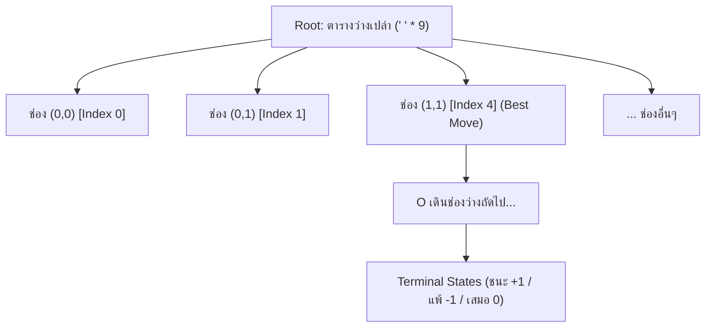

<p align="center">
  
</p>

<h1 align="center">เกม OX (Tic-Tac-Toe) ด้วย BFS Game Tree Algorithm</h1>

<p align="center">
  
  
  
</p>

เกม OX (Tic-Tac-Toe) บนตารางขนาด 3x3 พัฒนาด้วยภาษา **Python** ที่ขับเคลื่อนด้วย **Breadth-First Search (BFS) Game Tree Algorithm** [Still Develope]

---

##  คุณสมบัติเด่น (Features)

1. **BFS Game Tree เต็มรูปแบบจาก State ว่างเปล่า**:
   - เริ่มต้นแตกกิ่งทั้งหมดตั้งแต่ Root ที่เป็นตารางว่างเปล่า 3x3 (`' ' * 9`)
   - แตกกิ่งแบบทีละระดับ (Level-by-Level) ด้วยคิว `collections.deque` (Queue-based FIFO)
   - ครอบคลุมสถานะที่เป็นไปได้ทั้งหมด **549,946 โหนด** และ **255,168 กิ่งผลลัพธ์ (Leaves)** ในเวลาเพียง ~1 วินาที
2. **ระบบให้คะแนนตามกิ่ง (Branch Scoring)**:
   - **ชนะ (Win)**: $+1$
   - **แพ้ (Loss)**: $-1$
   - **เสมอ (Draw)**: $0$
   - **คะแนนรวมของกิ่ง (Branch Score)**:
     $$\text{Score} = (\text{Wins} \times +1) + (\text{Losses} \times -1) + (\text{Draws} \times 0)$$
   - พร้อมแสดงอัตราการชนะ (Win Rate %) และค่า Minimax
3. **Live DEBUG ละเอียดในทุก Turn การเล่น**:
   - พิมพ์ลงทั้ง **Terminal Console (stdout)** และแสดงใน **GUI Live Debug Console**
   - แสดงรายการกิ่งที่เป็นไปได้ทั้งหมดในสถานะปัจจุบัน
   - สรุปสถิติกิ่งชนะ กิ่งแพ้ กิ่งเสมอ คะแนนรวม และรูปตารางพรีวิวของแต่ละกิ่ง
   - ไฮไลต์กิ่งที่ดีที่สุดที่ AI เลือกเดิน
4. **ส่วนติดต่อผู้ใช้กราฟิก (Tkinter GUI)**:
   - ดีไซน์สวยงาม ทันสมัย ใช้งานง่าย
   - โหมดการเล่น:  ผู้เล่น (X) vs  บอท BFS (O)
   - ขยายตารางเล่นเกมกว้างประมาณ 40% ของหน้าต่าง พร้อมล็อคขนาดช่องตารางไม่ให้เลื่อนขยับ
   - ไฮไลต์เส้นที่ชนะ (Winning line)
   - ปุ่ม Copy Log และ Clear Log

---

##  โครงสร้างไฟล์ในโปรเจกต์

```
d:/OX-BFS/
│
├── assets/             # SVG icons สำหรับแสดงผลบน GitHub
│   ├── bot.svg
│   ├── cpu.svg
│   ├── folder.svg
│   ├── gamepad.svg
│   ├── rocket.svg
│   ├── star.svg
│   └── user.svg
├── ox_bfs_engine.py    # Core Engine: โครงสร้าง BFS Game Tree, คิว และการคำนวณคะแนน
├── ox_debug.py         # Debug Formatter: จัดรูปแบบข้อความ DEBUG และพรีวิวตาราง ASCII
├── gui.py              # หน้าต่างกราฟิก Tkinter และระบบจัดการ Event
├── main.py             # จุดเริ่มต้นรันโปรแกรม (รองรับทั้ง GUI และ CLI)
├── test_engine.py      # ชุดทดสอบ Unit Tests สำหรับ BFS Engine (7 การทดสอบ)
├── test_gui.py         # ชุดทดสอบ Unit Tests สำหรับระบบ GUI (3 การทดสอบ)
└── README.md           # เอกสารอธิบายการใช้งานและหลักการอัลกอริทึม
```

---

##  วิธีการติดตั้งและเปิดใช้งาน (How to Run)

โปรเจกต์นี้ใช้ไลบรารีมาตรฐานของ Python ทั้งหมด (`tkinter`, `collections`, `time`, `unittest`) ไม่จำเป็นต้องติดตั้งไลบรารีภายนอกเพิ่มเติม

### 1. รันเกมพร้อม GUI (แนะนำ)
```bash
python main.py
```

### 2. รันโหมด Terminal / CLI Demonstration
สำหรับดูการทำงานของ BFS และ DEBUG บนหน้าจอคอนโซลอย่างเดียว:
```bash
python main.py --cli
```

### 3. รันชุดทดสอบระบบอัตโนมัติ (Automated Tests)
```bash
python test_engine.py
python test_gui.py
```

---

##  หลักการทำงานของอัลกอริทึม BFS Game Tree



1. **Breadth-First Expansion**:
   นำโหนดใส่ `deque` และดึงออกมาทีละตัวเพื่อแตกกิ่งไปยังช่องที่ยังว่างอยู่ (`' '`) เมื่อพบสถานะสิ้นสุด (Terminal State) จะหยุดแตกกิ่งในสายนั้น
2. **Bottom-Up Reverse BFS Score Propagation**:
   เมื่อประมวลผล BFS เสร็จสิ้น จะย้อนลำดับจากโหนดปลายทางกลับขึ้นมาสู่ Root:
   - นับผลรวมของกิ่งลูก: $\text{Wins}$, $\text{Losses}$, $\text{Draws}$
   - คำนวณค่า Minimax เพื่อการันตีการเล่นที่ไม่เพลี่ยงพล้ำ
3. **การเลือกตาเดินของ AI (Decision Strategy)**:
   - **Direct Win**: หากมีตาเดินที่ทำให้ชนะทันที จะเลือกเดินทันที
   - **Direct Block**: หากคู่ต่อสู้มีโอกาสชนะในตาถัดไป จะต้องบล็อกทันที
   - **Optimal Branch Selection**: เลือกกิ่งที่มี Minimax ดีที่สุด และมีคะแนนผลรวมกิ่ง (Branch Score) สูงที่สุด

