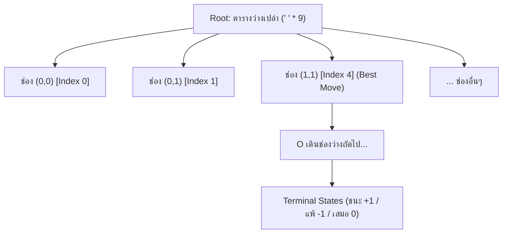

<p align="center">
  
</p>

<h1 align="center">เกม OX (Tic-Tac-Toe) ด้วย BFS Game Tree Algorithm</h1>

<p align="center">
  
  
  
</p>

เกม OX (Tic-Tac-Toe) บนตารางขนาด 3x3 พัฒนาด้วยภาษา **Python** ที่ขับเคลื่อนด้วย **Breadth-First Search (BFS) Game Tree Algorithm**

---

##  คุณสมบัติเด่น (Features)

1. **BFS Game Tree เต็มรูปแบบจาก State ว่างเปล่า**:
   - เริ่มต้นแตกกิ่งทั้งหมดตั้งแต่ Root ที่เป็นตารางว่างเปล่า 3x3 (`' ' * 9`)
   - แตกกิ่งแบบทีละระดับ (Level-by-Level) ด้วยคิว `collections.deque` (Queue-based FIFO)
   - ครอบคลุมสถานะที่เป็นไปได้ทั้งหมด **549,946 โหนด** และ **255,168 กิ่งผลลัพธ์ (Leaves)** ในเวลาเพียง ~1 วินาที
2. **ระบบให้คะแนนตามกิ่ง (Branch Scoring)**:
   - **ชนะ (Win)**: $+1$
   - **แพ้ (Loss)**: $-1$
   - **เสมอ (Draw)**: $0$
   - **คะแนนรวมของกิ่ง (Branch Score)**:
     $$\text{Score} = (\text{Wins} \times +1) + (\text{Losses} \times -1) + (\text{Draws} \times 0)$$
   - พร้อมแสดงอัตราการชนะ (Win Rate %) และค่า Minimax
3. **Live DEBUG ละเอียดใน Turn ของ AI**:
   - พิมพ์ลงทั้ง **Terminal Console (stdout)** และแสดงใน **GUI Live Debug Console** เมื่อถึงตาของบอท BFS
   - แสดงรายการกิ่งที่เป็นไปได้ทั้งหมดในสถานะปัจจุบัน
   - สรุปสถิติกิ่งชนะ กิ่งแพ้ กิ่งเสมอ คะแนนรวม และรูปตารางพรีวิวของแต่ละกิ่ง
   - ไฮไลต์กิ่งที่ดีที่สุดที่ AI เลือกเดิน
4. **ส่วนติดต่อผู้ใช้กราฟิก (Tkinter GUI)**:
   - ดีไซน์สวยงาม ทันสมัย ใช้งานง่าย
   - โหมดการเล่น:  ผู้เล่น (X) vs  บอท BFS (O)
   - ขยายตารางเล่นเกมกว้างประมาณ 40% ของหน้าต่าง พร้อมล็อคขนาดช่องตารางไม่ให้เลื่อนขยับ
   - ไฮไลต์เส้นที่ชนะ (Winning line)

---

##  โครงสร้างไฟล์ในโปรเจกต์

```
d:/OX-BFS/
│
├── core_bfs.py         # Logic หลัก: โครงสร้าง BFS Game Tree, คิว และการคำนวณคะแนน
├── ox_debug.py         # Debug Formatter: จัดรูปแบบข้อความ DEBUG และพรีวิวตาราง ASCII
├── gui.py              # หน้าต่างกราฟิก Tkinter และระบบจัดการ Event
├── main.py             # จุดเริ่มต้นรันโปรแกรม
└── README.md           # เอกสารอธิบายการใช้งานและหลักการอัลกอริทึม
```

---

##  วิธีการติดตั้งและเปิดใช้งาน (How to Run)

โปรเจกต์นี้ใช้ไลบรารีมาตรฐานของ Python ทั้งหมด (`tkinter`, `collections`) ไม่จำเป็นต้องติดตั้งไลบรารีภายนอกเพิ่มเติม

```bash
python main.py
```

---

##  หลักการทำงานของอัลกอริทึม BFS Game Tree



อัลกอริทึมทำงานเป็น **2 เฟส**:

### เฟส 1 — สร้าง BFS Game Tree ครั้งเดียวตอนเปิดโปรแกรม (Precompute ~1 วินาที)

1. **Breadth-First Expansion (ขยายทีละระดับด้วยคิวแบบ FIFO)**:
   - เริ่มจาก Root = ตารางว่าง `' ' * 9` ใส่เข้า `collections.deque` (`append`)
   - `popleft()` ดึงโหนดจาก **หัวคิว** → รับประกันการเรียงลําดับแบบ **Level-Order Traversal** คือขยาย depth `0 → 1 → 2 → ... → 9` ทีละระดับ
   - แต่ละโหนดกระจายไปยังช่องว่างทุกช่อง (`' '`) สร้างโหนดลูกที่ depth+1 แล้ว `append` เข้าท้ายคิว
   - เจอ Terminal State (ชนะ/เสมอ) → **ตัดกิ่ง (Prune)** ไม่ขยายต่อ และกลายเป็น Leaf
   - ได้ครบทั้ง **549,946 โหนด** และ **255,168 ใบไม้** ในเวลาประมาณ 1 วินาที
2. **`state_map` (Cache สถานะ)**:
   - ระหว่าง BFS จดทุกโหนดลง Dict `state_map[(board, player_turn)] = node`
   - เป็นทั้ง "Visited Set" และ "Lookup Table" → ตอนเล่นเกมหาสถานะปัจจุบันเจอใน **O(1)** โดยไม่ต้องคำนวณซ้ำ
3. **Bottom-Up Reverse Score Propagation (สะสมผลย้อนกลับ)**:
   - BFS เก็บ `all_nodes` ให้โหนดแม่มาก่อนลูกเสมอ → การวน `reversed(all_nodes)` จึงรับประกันว่าลูกถูกประมวลผลก่อนแม่
   - ใบไม้ถูกตั้งค่าก่อน: X ชนะ `+1`, O ชนะ `-1`, เสมอ `0` จากนั้นสะสม `wins_x / wins_o / draws` ขึ้นสู่ต้นน้ำ
   - แต่ละโหนดคำนวณ `minimax_val` = `max()` เมื่อถึงตา X / `min()` เมื่อถึงตา O

### เฟส 2 — เลือกตาเดินจาก BFS Tree ที่คำนวณไว้แล้ว (Runtime)

ไม่ต้องสร้าง tree ใหม่ เพียงค้นหาโหนดปัจจุบันใน `state_map` แล้วอ่านสถิติที่มีอยู่:

- **Direct Win**: ถ้าเดินแล้วชนะทันที → เลือกเดินทันที
- **Direct Block**: ถ้าคู่แข่งกำลังจะชนะในตาถัดไป → เดินบล็อกทันที
- **Optimal Branch Selection**: เลือกกิ่งที่มี `minimax_val` สูงสุด และในกลุ่มเดียวกันเลือกคะแนนรวม (Branch Score) สูงสุด

---

##  คำอธิบายการทำงานของแต่ละฟังก์ชัน (Function Explanations)

### 1. ไฟล์ `core_bfs.py` (Logic หลัก BFS Game Tree)

โมดูลที่สร้างและค้นหา BFS Game Tree ทั้งหมด **549,946 โหนด**:

- **ค่าคงที่ (Configuration)**:
  - `WINNING_COMBOS`: เส้นคอมโบชนะทั้งหมด 8 เส้น (3 แนวนอน / 3 แนวตั้ง / 2 แนวทแยง) ฮาร์ดโค้ดสำหรับตาราง 3x3

- **ฟังก์ชันช่วยระดับโมดูล**:
  - `get_opponent(player)`: คืนคู่แข่ง (`'X'` → `'O'`, `'O'` → `'X'`) — ใช้สลับตาเดินระหว่างโหนดแม่กับลูกใน BFS Expansion
  - `swap_symbols(board)`: สลับ `X↔O` ทั้งกระดานด้วย `str.maketrans` — ใช้ใน `evaluate_branches` เมื่อไม่พบสถานะตรงใน `state_map` ให้ค้นหาแบบสลับข้างแทน
  - `place_symbol(board, position, player)`: วางหมากแบบ Immutable แล้วคืนสตริงกระดานใหม่ — ทุกโหนดลูกของ BFS แทนผลลัพธ์หนึ่งการวาง
  - `check_board_winner(board)`: ตรวจผู้ชนะ/เสมอจาก `WINNING_COMBOS` คืน `'X'` / `'O'` / `'Draw'` / `None` — ใช้ตัดสินว่า BFS ควรหยุดตัดกิ่ง (Leaf) หรือขยายต่อ

- **คลาส `GameNode` (โหนดใน BFS Tree)**:
  - `__init__(board, player_turn, move, depth)`: เก็บข้อมูลโหนด — `board` ปัจจุบัน, `player_turn` (ผู้เล่นที่ได้เดิน), `move` ที่เข้ามา, `depth` ระดับความลึกใน BFS, ลูก `children`, และ `is_terminal` (true เมื่อเกมจบ)
  - สถิติที่จะถูกเติมหลัง BFS: `wins_x`, `wins_o`, `draws`, `minimax_val` — ค่าทั้งหมดถูกสะสมแบบ Bottom-Up โดย `_build_tree`

- **คลาส `OXBFSTree` (ตัวสร้าง + ค้นหา BFS Tree)**:
  - `__init__()`: ตั้งต้นและเรียก `_build_tree()` ทันที — ต้นไม้ถูกสร้างครั้งเดียวตอนเริ่มโปรแกรม (~1 วินาที)
  - `_build_tree()`: **หัวใจของ BFS**
    1. สร้าง Root `' ' * 9` → ใส่ `deque` พร้อม `all_nodes` และลง `state_map`
    2. วน `popleft()` (FIFO) ทีละโหนด → แตกไปยังช่องว่างทุกช่อง → สร้างลูก depth+1 → `append` เข้าท้ายคิว + ลง `state_map` จนครบ 549,946 โหนด
    3. `for node in reversed(all_nodes)`: ลูกถูกประมวลผลก่อนแม่เสมอ → สะสม `wins_x / wins_o / draws` จากใบไม้ขึ้นสู่ Root → คำนวณ `minimax_val` = `max()` ที่ตา X / `min()` ที่ตา O
  - `get_node(board, player_turn)`: ค้นหาโหนดจาก `state_map` → **O(1) lookup**
  - `evaluate_branches(current_board, current_player)`: ประเมินกิ่งทางเลือกทั้งหมดจากสถานะปัจจุบัน
    1. ค้นหาโหนดใน `state_map`; ถ้าไม่พบ สลับ `X↔O` ด้วย `swap_symbols` แล้วค้นหาอีกครั้ง (`is_swapped = True`)
    2. วนลูกทุกตัวดึงสถิติ BFS ที่คำนวณไว้แล้ว แปลงมุมมองให้เป็นของผู้เล่นปัจจุบัน (กรณี O: กลับเครื่องหมาย `minimax_val` สลับ `wins_x↔wins_o`)
    3. คำนวณ `score = wins − losses`, `win_rate` ประกอบเป็น dict กิ่ง
    4. เลือกตาเดิน: ชนะทันที → บล็อกคู่แข่ง → `minimax_val` สูงสุด → คะแนนสูงสุด
  - `get_debug_text(...)`: ส่งต่อให้ `ox_debug` เรนเดอร์ผลวิเคราะห์จาก BFS Tree

---

### 2. ไฟล์ `ox_debug.py` (แสดงผลข้อมูลจาก BFS)

- `format_row(board, start_index, size)`: แปลงแถวกระดานเป็นข้อความ เช่น `. | X | .`
- `get_branch_score(branch)`: คืน `branch['score']` ใช้เป็นคีย์จัดเรียงกิ่ง
- `get_debug_text(tree, current_board, current_player, turn_number, chosen_move=None)`:
  - เรียก `tree.evaluate_branches(...)` ดึงกิ่งทั้งหมดจาก BFS Tree
  - เรียงกิ่งตามคะแนน ใส่เครื่องหมาย `★ [BEST MOVE]` / `[DIRECT ...]` แต่ละกิ่ง
  - แสดงผลค่า `minimax_val` + Preview ตารางลูกทุกอัน + สรุปตาเดินที่ BFS เลือก

---

### 3. ไฟล์ `gui.py` (อินเทอร์เฟซที่เรียกใช้ BFS)

- `place_symbol(...)`: วางหมากในสตริงกระดาน (เหมือน engine ใช้ใน GUI)
- **คลาส `OXGameGUI`**:
  - `__init__(root)`: ตั้งค่าหน้าต่าง Tkinter 1180x740, สี, ตัวแปรเกม, เรียก `_init_engine()`
  - `_init_engine()`: สร้าง `OXBFSTree()` — **จุดเริ่มต้นของ BFS Precompute**
  - `_create_widgets()`: จัด layout 40:60, กระดานปุ่ม 3x3 (ล็อคขนาด `uniform="cell"`), Debug Console ฝั่งขวา
  - `_on_cell_clicked(idx)`: รับคลิกจากผู้เล่น ส่งต่อไป `_execute_move`
  - `_execute_move(move_idx)`: วางหมาก, เรียก `tree.get_debug_text(...)` เมื่อถึงตาบอท, อัปเดต UI, สลับเทิร์น
  - `_ai_turn()`: เรียก `tree.evaluate_branches(board, 'O')` → ได้ `best_move` จาก BFS Tree → เดินหมากอัตโนมัติ
  - `start_new_game()`: รีเซ็ตกระดาน `' ' * 9`, ล้าง Debug, คืนค่าปุ่ม 9 ช่อง
  - `_update_status(text, is_over)`: อัปเดตข้อความ/สีแถบสถานะ
  - `_update_scoreboard()`: อัปเดตคะแนน X/O/Draw
  - `_highlight_winning_line(combo)`: เปลี่ยนสีพื้นหลังเส้นที่ชนะ
  - `_check_game_end()`: ตรวจจบเกม บันทึกคะแนน แสดงผลลัพธ์
  - `_append_debug_log(text)` / `_clear_debug_log()`: แสดง/ล้างข้อความ Debug

---

### 4. ไฟล์ `main.py` (จุดเริ่มต้น)

- `main()`: สร้าง `tk.Tk()` → ผูกกับ `OXGameGUI` → เริ่ม `root.mainloop()`
