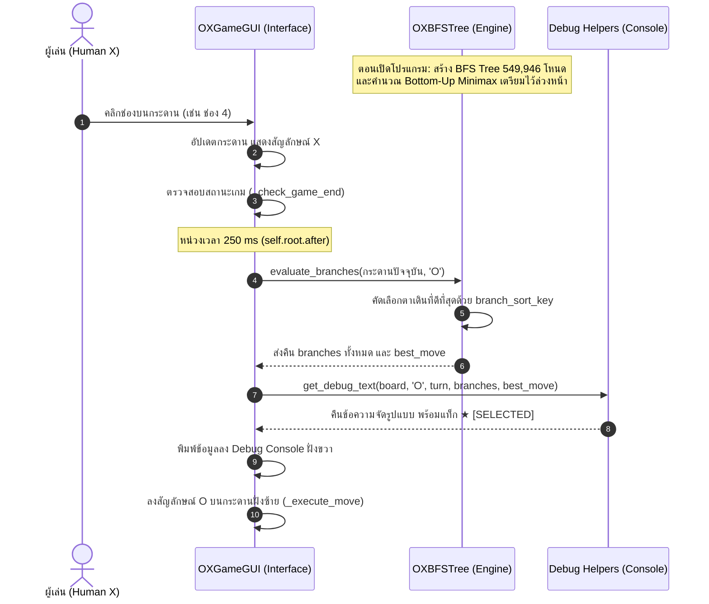

# คู่มือเตรียมสอบตอบคำถาม: เจาะลึกโค้ด main.py ทีละส่วน
> **เอกสารคู่มือเตรียมสอบตอบคำถาม (Code Defense Guide)**  
> รวบรวมคำถามยอดฮิตในห้องสอบ: **"โค้ดส่วนนี้ทำหน้าที่อะไร?"** เจาะลึกทุกคลาส ทุกฟังก์ชัน และทุกบรรทัดสำคัญใน [`main.py`](main.py)

---

## สารบัญคำถามตามโครงสร้างไฟล์
1. [ส่วนหัวโปรแกรมและค่าคงที่ (`EMPTY_BOARD`)](#1-ส่วนหัวโปรแกรมและค่าคงที่)
2. [คลาส `OXBoard` (กฎกติกาและกระดาน)](#2-คลาส-oxboard-กฎกติกาและกระดาน)
3. [คลาส `GameNode` (โครงสร้างโหนดต้นไม้)](#3-คลาส-gamenode-โครงสร้างโหนดต้นไม้)
4. [ฟังก์ชัน `branch_sort_key` (เกณฑ์ตัดสินตาเดินและจัดอันดับ)](#4-ฟังก์ชัน-branch_sort_key-เกณฑ์ตัดสินตาเดินและจัดอันดับ)
5. [คลาส `OXBFSTree` (การสร้างต้นไม้ BFS และคำนวณ Minimax)](#5-คลาส-oxbfstree-การสร้างต้นไม้-bfs-และคำนวณ-minimax)
6. [ฟังก์ชัน Debug (`format_row` และ `get_debug_text`)](#6-ฟังก์ชัน-debug-format_row-และ-get_debug_text)
7. [คลาส `OXGameGUI` (ระบบหน้าต่างและควบคุมการเล่น)](#7-คลาส-oxgamegui-ระบบหน้าต่างและควบคุมการเล่น)
8. [จุดเริ่มรันโปรแกรม (`if __name__ == '__main__':`)](#8-จุดเริ่มรันโปรแกรม)
9. [แผนภาพลำดับการทำงาน (Sequence Diagram)](#9-แผนภาพลำดับการทำงาน)

---

## 1. ส่วนหัวโปรแกรมและค่าคงที่

### Q: บรรทัด `EMPTY_BOARD = ' ' * 9` ทำหน้าที่อะไร?
```python
EMPTY_BOARD = ' ' * 9
```
* **หน้าที่หลัก:** ใช้สร้างและแทนค่า **"กระดานเริ่มต้นที่ยังว่างเปล่า"** ซึ่งประกอบด้วยช่องว่าง 9 ตัว (`'         '`)
* **เจาะลึก:** แทนที่เราจะพิมพ์ `' ' * 9` ซ้ำ ๆ หลายที่ในโค้ด เราประกาศเป็นค่าคงที่ (Constant) ไว้บนสุด เพื่อให้เรียกใช้ซ้ำได้ง่าย และถ้าอนาคตต้องการเปลี่ยนสัญลักษณ์ช่องว่าง ก็แก้ที่บรรทัดนี้เพียงจุดเดียว

---

## 2. คลาส `OXBoard` (กฎกติกาและกระดาน)

### Q: ทูเพิล `WINNING_COMBOS` ทำหน้าที่อะไร?
```python
WINNING_COMBOS = (
    (0, 1, 2), (3, 4, 5), (6, 7, 8),
    (0, 3, 6), (1, 4, 7), (2, 5, 8),
    (0, 4, 8), (2, 4, 6)
)
```
* **หน้าที่หลัก:** เก็บ **ดัชนีตำแหน่งช่องบนกระดาน 9 ช่อง (0 ถึง 8) ของเส้นที่ทำให้ชนะเกมทั้ง 8 เส้นทาง**
* **เจาะลึก:**
  * แนวนอน 3 เส้น: `(0,1,2)`, `(3,4,5)`, `(6,7,8)`
  * แนวตั้ง 3 เส้น: `(0,3,6)`, `(1,4,7)`, `(2,5,8)`
  * ทแยงมุม 2 เส้น: `(0,4,8)`, `(2,4,6)`
* **จุดที่นำไปใช้:** ใช้ใน `check_winner()` เพื่อตรวจหาผู้ชนะ และใช้ใน `_check_game_end()` เพื่อระบุ 3 ช่องที่จะเปลี่ยนสีพื้นหลังเป็นสีเขียวเมื่อมีคนชนะ

---

### Q: เมธอด `get_opponent(player)` ทำหน้าที่อะไร?
```python
@staticmethod
def get_opponent(player):
    return 'O' if player == 'X' else 'X'
```
* **หน้าที่หลัก:** ทำหน้าที่ **สลับเทิร์นผู้เล่น** หากส่ง `'X'` เข้าไปจะได้ `'O'` และถ้าส่งตัวอื่นจะได้ `'X'`
* **เจาะลึก:** ใช้เปลี่ยนตาเดินของเกมในแต่ละรอบ ทั้งตอนสร้างต้นไม้ BFS และตอนเล่นเกมจริงบน GUI

---

### Q: เมธอด `place_symbol(board, position, player)` ทำหน้าที่อะไร? ทำไมต้องเขียนแบบนี้?
```python
@staticmethod
def place_symbol(board, position, player):
    return board[:position] + player + board[position + 1:]
```
* **หน้าที่หลัก:** ทำหน้าที่ **วางสัญลักษณ์ (`'X'` หรือ `'O'`) ลงบนกระดานในตำแหน่ง `position` ที่กำหนด**
* **เจาะลึก (เทคนิค String Slicing):**
  1. `board[:position]`: ตัดเอาสตริงส่วนหน้าก่อนถึงตำแหน่งที่จะลง
  2. `+ player`: แทรกตัวอักษรของผู้เล่นลงไปตรงกลาง
  3. `+ board[position + 1:]`: ตัดเอาสตริงส่วนหลังตั้งแต่ถัดจากตำแหน่งนั้นไปจนจบ
* **ทำไมต้องเขียนแบบนี้:** เพราะในภาษา Python สตริงเป็นข้อมูลประเภท Immutable (ไม่สามารถแก้ค่าในตัวแปรเดิมได้ตรง ๆ เหมือน List เช่น `board[0] = 'X'` จะ Error) จึงต้องตัดต่อแล้วสร้างเป็นสตริงใหม่ส่งกลับไป

---

### Q: เมธอด `check_winner(board)` ทำหน้าที่อะไร?
```python
@staticmethod
def check_winner(board):
    for a, b, c in OXBoard.WINNING_COMBOS:
        if board[a] != ' ' and board[a] == board[b] == board[c]:
            return board[a]
    if ' ' not in board:
        return 'Draw'
    return None
```
* **หน้าที่หลัก:** ทำหน้าที่ **ตรวจสอบสถานะกระดานว่ามีผู้ชนะ หรือเสมอ หรือเกมยังไม่จบ**
* **เจาะลึก:**
  1. วนลูปตรวจ 3 ช่องตามเส้นใน `WINNING_COMBOS`: ถ้าช่องไม่ว่าง (`!= ' '`) และทั้ง 3 ช่องเป็นตัวเดียวกัน (`board[a] == board[b] == board[c]`) ➔ คืนค่าตัวอักษรผู้ชนะ (`'X'` หรือ `'O'`)
  2. ถ้าไม่มีใครชนะ แต่ไม่มีช่องว่างเหลือแล้ว (`' ' not in board`) ➔ คืนค่า `'Draw'` (เสมอ)
  3. ถ้ายังไม่มีใครชนะและยังมีช่องว่าง ➔ คืนค่า `None` (เกมยังดำเนินอยู่)

---

## 3. คลาส `GameNode` (โครงสร้างโหนดต้นไม้)

### Q: ตัวแปรแต่ละตัวใน `GameNode.__init__` ทำหน้าที่อะไร?
```python
class GameNode:
    def __init__(self, board, player_turn, move=None):
        self.board = board
        self.player_turn = player_turn
        self.move = move
        self.children = []
        self.winner = OXBoard.check_winner(board)
        self.minimax_val = None
        self.steps_to_end = 0
```
* **หน้าที่หลักของแต่ละตัวแปร:**
  * `self.board`: สตริงความยาว 9 ตัวอักษร เก็บภาพจำลองหน้าตากระดาน ณ โหนดนั้น
  * `self.player_turn`: ใครเป็นคนมีสิทธิ์เดินในตานี้ (`'X'` หรือ `'O'`)
  * `self.move`: ตำแหน่งช่อง (0–8) ที่เพิ่งเดินจากโหนดแม่จนเกิดเป็นโหนดนี้
  * `self.children`: ลิสต์เก็บโหนดลูกที่เป็นไปได้ทั้งหมดในตาถัดไป
  * `self.winner`: ผลการตรวจผู้ชนะ ณ โหนดนี้ (`'X'`, `'O'`, `'Draw'` หรือ `None`)
  * `self.minimax_val`: ค่าประเมินสถานะตามหลัก Minimax (`+1` = X ชนะ, `-1` = O ชนะ, `0` = เสมอ)
  * `self.steps_to_end`: จำนวนตาเดินจนกว่าเกมจะจบ (ใช้เลือกว่าชนะเร็วที่สุด หรือแพ้ยื้อนานที่สุด)

---

### Q: ทำไมใน `GameNode` ถึงไม่ต้องสร้างตัวแปร `is_terminal` แยกต่างหาก?
* **หน้าที่หลัก:** ใช้ตัวแปร `self.winner` ทำหน้าที่แทนได้สมบูรณ์แบบ 100%
* **เจาะลึก:** ในภาษา Python สตริงที่มีตัวอักษร (`'X'`, `'O'`, `'Draw'`) จะมีค่าความจริงเป็น `True` อยู่แล้ว ส่วนสถานะที่เกมยังไม่จบจะมีค่าเป็น `None` ซึ่งเป็น `False` ดังนั้นการเขียน `if node.winner:` จึงสามารถตรวจสอบการจบเกมได้ทันที การตัด `self.is_terminal` ออก ช่วยประหยัดหน่วยความจำของโหนดทั้ง 549,946 โหนดได้อย่างมหาศาล

---

## 4. ฟังก์ชัน `branch_sort_key` (เกณฑ์ตัดสินตาเดินและจัดอันดับ)

### Q: ฟังก์ชัน `branch_sort_key(b)` ทำหน้าที่อะไร? ทำไมตอนชนะก้าวเดินต้องติดลบ?
```python
def branch_sort_key(b):
    if b['minimax_val'] == 1:
        return (1, -b['steps'])
    if b['minimax_val'] == -1:
        return (-1, b['steps'])
    return (0, 0)
```
* **หน้าที่หลัก:** ทำหน้าที่ **กำหนดลำดับคะแนนความสำคัญ (Priority Key) เพื่อใช้เลือกตาเดินที่ดีที่สุด และจัดอันดับกิ่งใน Debug Console** จากดีที่สุดไปแย่ที่สุด
* **เจาะลึก:**
  1. พิจารณาคะแนน Minimax ก่อน: ชนะ (`1`) ดีกว่า เสมอ (`0`) และดีกว่า แพ้ (`-1`)
  2. หากคะแนนเท่ากัน จะพิจารณาจำนวนก้าวเดิน (`steps`):
     * **กรณีชนะ (`1`):** ผู้เล่นต้องการ **"ชนะให้เร็วที่สุด"** (ก้าวเดินน้อย = ดีกว่า เช่น ชนะใน 1 ตา ดีกว่า 3 ตา) เมื่อใส่เครื่องหมายลบ `-1` จะมีค่ามากกว่า `-3` ทำให้กิ่งที่ชนะเร็วที่สุดถูกจัดอยู่อันดับ 1 เสมอ
     * **กรณีแพ้ (`-1`):** ผู้เล่นต้องการ **"ยื้อเกมให้นานที่สุด"** (ก้าวเดินมาก = ดีกว่า เช่น ยื้อได้ 5 ตา ดีกว่าแพ้ใน 2 ตา) ค่า `5` มากกว่า `2` ทำให้กิ่งที่ยื้อนานที่สุดถูกจัดขึ้นมาก่อน เพื่อรอจังหวะคู่แข่งเดินพลาด
     * **กรณีเสมอ (`0`):** ให้คะแนนลำดับความสำคัญเท่ากัน `(0, 0)`

---

## 5. คลาส `OXBFSTree` (การสร้างต้นไม้ BFS และคำนวณ Minimax)

### Q: ตัวแปร `self.state_map` ทำหน้าที่อะไร?
```python
self.state_map = {}
...
self.state_map[(child.board, next_player)] = child
```
* **หน้าที่หลัก:** เป็น **สารบัญค้นหาโหนดด่วน (Hash Table)** โดยใช้คู่ลำดับ `(board, player)` เป็นคีย์ และเก็บ Object โหนดจริงเป็นค่า
* **เจาะลึก:** ช่วยให้ตอนเล่นเกม AI สามารถค้นหากระดานปัจจุบันได้ทันทีในเวลา **$O(1)$** โดยไม่ต้องเสียเวลาค้นหาจากต้นไม้ทั้งหมด 549,946 โหนด

---

### Q: บรรทัด `queue = deque([self.root])` ทำหน้าที่อะไร? ทำไมต้องใช้ `deque`?
```python
queue = deque([self.root])
...
node = queue.popleft()
```
* **หน้าที่หลัก:** เป็นคิวสำหรับขั้นตอน **Breadth-First Search (BFS)** เพื่อสร้างต้นไม้ทีละชั้น
* **ทำไมต้องใช้ `deque`:** เพราะ `collections.deque` รองรับคำสั่ง `popleft()` (ดึงตัวหน้าสุดออกจากคิว) ด้วยความเร็วคงที่ **$O(1)$** ขณะที่ List ธรรมดา `pop(0)` ต้องเลื่อนสมาชิกทั้งลิสต์ซึ่งใช้เวลา $O(N)$ หากใช้ List ธรรมดากับข้อมูล 5.4 แสนโหนด โปรแกรมจะเปิดช้ามาก

---

### Q: บรรทัด `if node.winner: continue` ในลูปสร้างต้นไม้ทำหน้าที่อะไร?
```python
while queue:
    node = queue.popleft()
    if node.winner:
        continue
```
* **หน้าที่หลัก:** ทำหน้าที่ **หยุดการแตกกิ่งต่อ เมื่อพบว่ากระดานนั้นจบเกมแล้ว**
* **เจาะลึก:** ถ้ากระดานนั้นมีผู้ชนะแล้ว หรือเสมอกันแล้ว จะสั่ง `continue` เพื่อข้ามการสร้างกิ่งลูก ป้องกันไม่ให้แตกกิ่งเดินต่อในเกมที่จบไปแล้ว

---

### Q: บรรทัด `for pos in range(9): if node.board[pos] == ' ':` ทำหน้าที่อะไร?
```python
for pos in range(9):
    if node.board[pos] == ' ':
        next_board = OXBoard.place_symbol(node.board, pos, node.player_turn)
        child = GameNode(next_board, next_player, pos)
        node.children.append(child)
        queue.append(child)
        all_nodes.append(child)
        self.state_map[(child.board, next_player)] = child
```
* **หน้าที่หลัก:** ทำหน้าที่ **ค้นหาทุกช่องที่ยังว่างอยู่ เพื่อแตกกิ่งลูกที่เป็นไปได้ทั้งหมดในตาถัดไป**
* **เจาะลึก:** ในแต่ละช่องว่าง ระบบจะจำลองการวางหมากของผู้เล่นคนนั้น (`place_symbol`) แล้วสร้างโหนดลูกขึ้นมา ต่อเข้ากับกิ่งแม่ และใส่ลงในคิวเพื่อรอแตกกิ่งชั้นถัดไป

---

### Q: ลูป `for node in reversed(all_nodes):` ทำหน้าที่อะไร? ทำไมต้อง `reversed`?
```python
for node in reversed(all_nodes):
    if node.winner:
        ...
    else:
        ...
```
* **หน้าที่หลัก:** ทำหน้าที่ **คำนวณคะแนน Minimax ย้อนกลับจากล่างขึ้นบน (Bottom-Up Minimax Backpropagation)**
* **ทำไมต้อง `reversed`:** เพราะตอนสร้างต้นไม้ด้วย BFS โหนดแม่จะถูกเก็บลง `all_nodes` ก่อนโหนดลูกเสมอ เมื่อเราวนลูปแบบย้อนกลับ (`reversed`) จะการันตีได้ 100% ว่า **โหนดลูกทุกโหนดจะถูกคำนวณคะแนนเสร็จก่อนโหนดแม่เสมอ** ทำให้คำนวณครบทั้งต้นไม้ได้ในลูปเดียว โดยไม่ต้องเขียนฟังก์ชัน Recursive ซ้อนกันให้เสี่ยงต่อ Stack Overflow

---

### Q: บล็อกคำนวณ Minimax ตอน X ใช้ `max(vals)` แต่ตอน O ใช้ `min(vals)` ทำหน้าที่อะไร?
```python
vals = [child.minimax_val for child in node.children]
if node.player_turn == 'X':
    best_val = max(vals)
    is_losing = (best_val == -1)
else:
    best_val = min(vals)
    is_losing = (best_val == 1)
```
* **หน้าที่หลัก:** จำลองการตัดสินใจที่ดีที่สุดของแต่ละฝ่ายตามทฤษฎีเกม Minimax:
  * **ในตาของ X:** X ต้องการให้ตัวเองชนะ (คะแนนสูงสุดคือ `+1`) จึงทำหน้าที่เป็น **Maximizer** โดยเลือกค่ามากสุด `max(vals)`
  * **ในตาของ O:** O ต้องการให้ตัวเองชนะ (คะแนนของ O ในต้นไม้คือ `-1`) จึงทำหน้าที่เป็น **Minimizer** โดยเลือกค่าน้อยสุด `min(vals)`
* **ตัวแปร `is_losing`:** ตรวจสอบว่าในตานั้นไม่ว่าจะเดินช่องไหนก็แพ้แน่นอนหรือไม่ (X ได้ -1 หรือ O ได้ +1) เพื่อนำไปใช้คำนวณก้าวเดินในบรรทัดถัดไป

---

### Q: บรรทัด `steps_to_end` ทำไมตอนแพ้ใช้ `max` แต่ตอนอื่นใช้ `min` และทำไมต้อง `+ 1`?
```python
best_children = [c for c in node.children if c.minimax_val == best_val]
if is_losing:
    node.steps_to_end = max(c.steps_to_end for c in best_children) + 1
else:
    node.steps_to_end = min(c.steps_to_end for c in best_children) + 1
```
* **หน้าที่หลัก:** คำนวณระยะก้าวเดินจนกว่าเกมจะจบ:
  * **ถ้ากำลังจะแพ้ (`is_losing`):** เลือกกิ่งลูกที่ใช้ก้าวเดินมากที่สุด `max(...)` เพื่อ **ยื้อเกมให้นานที่สุด (Delay Defeat)**
  * **ถ้ากำลังจะชนะหรือเสมอ (`else`):** เลือกกิ่งลูกที่ใช้ก้าวเดินน้อยที่สุด `min(...)` เพื่อ **ชนะให้เร็วที่สุด (Fastest Win)**
  * **ทำไมต้อง `+ 1`:** เพราะการเดินจากโหนดแม่ลงไปยังโหนดลูก ถือว่าใช้ตาเดินเพิ่มขึ้น 1 ก้าวเสมอ

---

### Q: ใน `evaluate_branches` บรรทัด `val = child.minimax_val if current_player == 'X' else -child.minimax_val` ทำหน้าที่อะไร?
```python
val = child.minimax_val if current_player == 'X' else -child.minimax_val
```
* **หน้าที่หลัก:** ปรับคะแนน Minimax ให้เป็น **"มุมมองของฝ่ายที่กำลังเดินเสมอ" (Normalized Value)**:
  * ในต้นไม้ `+1` คือ X ชนะ และ `-1` คือ O ชนะ
  * ถ้าปัจจุบันเป็นตาของ O การที่ O ชนะคือ `-1` เมื่อใส่เครื่องหมายลบ `-(-1)` จะกลายเป็น `+1`
  * ผลลัพธ์คือ ไม่ว่าจะเป็นตาของ X หรือ O ค่า `+1` จะหมายถึง "ฉันชนะ" และ `-1` จะหมายถึง "ฉันแพ้" เสมอ ทำให้เขียนโค้ดตัดสินใจได้ง่ายโดยไม่ต้องแยกเงื่อนไข

---

### Q: บรรทัด `best_move = max(branches, key=branch_sort_key)['move']` ทำหน้าที่อะไร?
```python
best_move = max(branches, key=branch_sort_key)['move']
return branches, best_move
```
* **หน้าที่หลัก:** ทำหน้าที่ **ตัดสินใจเลือกช่องเดินที่ดีที่สุดเพียง 1 ช่องจากกิ่งที่เป็นไปได้ทั้งหมด**
* **เจาะลึก:** ใช้คำสั่ง `max()` ของ Python โดยอิงเกณฑ์คะแนนจากฟังก์ชัน `branch_sort_key` ซึ่งการันตีว่าจะได้ตาเดินที่ดีที่สุด (ชนะเร็วสุด หรือยื้อนานสุด) ตรงกับอันดับ 1 ใน Debug Console เสมอ

---

## 6. ฟังก์ชัน Debug (`format_row` และ `get_debug_text`)

### Q: ฟังก์ชัน `format_row(board, start_index)` ทำหน้าที่อะไร?
```python
def format_row(board, start_index):
    cells = [char if char != ' ' else '.' for char in board[start_index:start_index + 3]]
    return " | ".join(cells)
```
* **หน้าที่หลัก:** แปลงตัวอักษร 3 ช่องในแถวนั้นให้เป็นข้อความตารางสวยงาม
* **เจาะลึก:** ตัดสตริงทีละ 3 ตัว (`board[start:start+3]`) หากช่องว่างให้แสดงเป็นจุด `.` เพื่อให้อ่านง่าย แล้วคั่นด้วย `" | "` เช่น `'X | . | O'`

---

### Q: ฟังก์ชัน `get_debug_text(board, player, turn, branches, selected_move)` ทำหน้าที่อะไร?
```python
def get_debug_text(board, player, turn, branches, selected_move):
    ...
```
* **หน้าที่หลัก:** ทำหน้าที่ **รวบรวมและจัดรูปแบบข้อมูลการวิเคราะห์ของ AI ทั้งหมดเพื่อส่งไปพิมพ์บน Debug Console ฝั่งขวา**
* **เจาะลึก:** 
  1. แสดงสถานะตารางปัจจุบัน
  2. แสดงจำนวนกิ่งลูกทั้งหมดที่เป็นไปได้
  3. จัดเรียงกิ่งตามลำดับคะแนนจากดีที่สุดไปแย่ที่สุด
  4. ติดแท็ก `★ [SELECTED]` ให้กับกิ่งที่ AI ตัดสินใจเลือกเดิน และติดแท็ก `[DIRECT WIN!]` หากกิ่งนั้นจบเกมทันที

---

## 7. คลาส `OXGameGUI` (ระบบหน้าต่างและควบคุมการเล่น)

### Q: ใน `_create_widgets` การสร้างปุ่มด้วย `lambda idx=i: self._on_cell_clicked(idx)` ทำหน้าที่อะไร?
```python
for i in range(9):
    btn = tk.Button(
        ...
        command=lambda idx=i: self._on_cell_clicked(idx)
    )
```
* **หน้าที่หลัก:** ทำหน้าที่ **ผูกคำสั่งคลิกของแต่ละปุ่มเข้ากับดัชนีช่องของตัวเอง (0 ถึง 8)**
* **ทำไมต้องใส่ `idx=i` (Default Argument Binding):** เพื่อล็อคค่าเลขช่อง `i` ประจำแต่ละปุ่มไว้ทันทีในรอบลูปนั้น หากไม่ใส่ `idx=i` เมื่อกดปุ่มใด ๆ ตัวแปร `i` จะกลายเป็นเลข 8 (ค่ารอบสุดท้ายของลูป) ทำให้คลิกช่องไหนก็กลายเป็นกดช่อง 8 ทั้งหมด

---

### Q: เมธอด `start_new_game(self)` ทำหน้าที่อะไร?
```python
def start_new_game(self):
    if self.ai_job:
        self.root.after_cancel(self.ai_job)
        self.ai_job = None

    self.debug_text.delete("1.0", tk.END)
    self.board = EMPTY_BOARD
    self.current_player = 'X'
    self.turn_count = 1
    self.game_over = False
    ...
```
* **หน้าที่หลัก:** ทำหน้าที่ **รีเซ็ตสถานะกระดานเพื่อเริ่มเกมรอบใหม่**
* **เจาะลึก:**
  * `after_cancel(self.ai_job)`: ยกเลิกการตั้งเวลาเดินของ AI ที่อาจยังค้างอยู่ เพื่อป้องกันไม่ให้บอทแอบมาเดินในกระดานใหม่
  * ล้างหน้าจอ Console และข้อความบนปุ่ม 9 ช่องให้กลับเป็นช่องว่าง
  * รีเซ็ตตัวแปร `board`, `current_player = 'X'`, `turn_count = 1`, `game_over = False`

---

### Q: เมธอด `_check_game_end(self)` ทำหน้าที่อะไร? ลูปตรวจเส้นชนะทำงานอย่างไร?
```python
def _check_game_end(self):
    winner = OXBoard.check_winner(self.board)
    if not winner:
        return False
    ...
    for a, b, c in OXBoard.WINNING_COMBOS:
        if self.board[a] == self.board[b] == self.board[c] == winner:
            for idx in (a, b, c):
                self.buttons[idx].config(bg="#C8E6C9")
            break
```
* **หน้าที่หลัก:** ทำหน้าที่ **ตรวจสอบว่ามีฝ่ายใดฝ่ายหนึ่งชนะหรือเสมอกันหลังการเดินหมากหรือไม่**
* **เจาะลึก:**
  1. ถ้ามีผู้ชนะ: เพิ่มคะแนนในตาราง Scoreboard และวนลูปหา 3 ช่องที่เรียงกันเพื่อเปลี่ยนสีพื้นหลังเป็น **สีเขียวอ่อน (`#C8E6C9`)** ให้ผู้เล่นมองเห็นเส้นที่ชนะชัดเจน
  2. อัปเดตข้อความสถานะด้านบน และบันทึกข้อความสรุปผลลง Debug Console
  3. คืนค่า `True` หากเกมจบลงแล้ว เพื่อหยุดไม่ให้เปลี่ยนเทิร์นต่อไป

---

### Q: เมธอด `_on_cell_clicked(self, idx)` มีเงื่อนไขตรวจสอบอะไรบ้าง?
```python
def _on_cell_clicked(self, idx):
    if not self.game_over and self.board[idx] == ' ' and self.current_player == 'X':
        self._execute_move(idx)
```
* **หน้าที่หลัก:** เป็นฟังก์ชันดักจับการคลิกช่องบนกระดานของผู้เล่นมนุษย์
* **เงื่อนไขตรวจสอบ (Guard Clauses):**
  1. `not self.game_over`: เกมต้องยังไม่จบ
  2. `self.board[idx] == ' '`: ช่องนั้นต้องเป็นช่องว่าง (ยังไม่มีใครลง)
  3. `self.current_player == 'X'`: ต้องเป็นตาเดินของผู้เล่นมนุษย์ (ป้องกันการคลิกแย่งเดินระหว่างที่บอทกำลังคิด)

---

### Q: ใน `_execute_move` คำสั่ง `self.ai_job = self.root.after(250, self._ai_turn)` ทำหน้าที่อะไร?
```python
self.ai_job = self.root.after(250, self._ai_turn)
```
* **หน้าที่หลัก:** สั่งให้ระบบ **หน่วงเวลา 250 มิลลิวินาที แล้วจึงเรียกเมธอด `_ai_turn` ให้บอทเริ่มเดิน**
* **ทำไมต้องหน่วงเวลา:** เพื่อให้หน้าจอ GUI มีเวลาเรนเดอร์สัญลักษณ์หมากของผู้เล่นมนุษย์ให้เสร็จเรียบร้อยก่อน และสร้างความรู้สึกเป็นธรรมชาติว่าบอทกำลังวิเคราะห์กิ่ง หากไม่หน่วงเวลา บอทจะเดินเสร็จในเสี้ยววินาทีจนสายตาผู้เล่นมองตามไม่ทัน

---

### Q: เมธอด `_ai_turn(self)` ทำหน้าที่อะไร? ทำไมเรียก `evaluate_branches` เพียงรอบเดียว?
```python
def _ai_turn(self):
    if not self.game_over and self.current_player == 'O':
        branches, best_move = self.tree.evaluate_branches(self.board, 'O')
        if best_move is not None:
            debug_info = get_debug_text(self.board, 'O', self.turn_count, branches, best_move)
            self._append_debug_log(debug_info + "\n")
            self._execute_move(best_move)
```
* **หน้าที่หลัก:** ควบคุมกระบวนการคิดและลงหมากของ AI:
  1. เรียก `evaluate_branches` เพื่อค้นหากิ่งและหาตาเดินที่ดีที่สุด (`best_move`)
  2. ส่งผลลัพธ์ต่อไปยัง `get_debug_text` เพื่อสร้างข้อความแสดงผลใน Console
  3. สั่ง `_execute_move` เพื่อลงหมากช่องนั้น
* **ทำไมเรียกเพียงรอบเดียว:** เป็นการปรับปรุงเพื่อ **ตัดความซ้ำซ้อน** ทำให้ไม่ต้องประเมินต้นไม้ซ้ำ 2 รอบในเทิร์นเดียวกัน บอทจึงตอบสนองได้อย่างรวดเร็ว

---

## 8. จุดเริ่มรันโปรแกรม

### Q: บล็อก `if __name__ == '__main__':` ทำหน้าที่อะไร?
```python
if __name__ == '__main__':
    root = tk.Tk()
    app = OXGameGUI(root)
    root.mainloop()
```
* **หน้าที่หลัก:** ทำหน้าที่เป็น **จุดเริ่มต้นการทำงานของโปรแกรม (Entry Point)**
* **เจาะลึก:**
  * เมื่อไฟล์นี้ถูกสั่งรันโดยตรง (เช่น รันผ่านคำสั่ง `python main.py`): ตัวแปร `__name__` จะมีค่าเป็น `'__main__'` บล็อกนี้จะทำงานโดยสร้างหน้าต่างหลัก `tk.Tk()`, สร้างแอป `OXGameGUI`, และเริ่มลูปเหตุการณ์ของหน้าจอ `root.mainloop()`
  * แต่ถ้าไฟล์นี้ถูกไฟล์อื่น `import main`: โค้ดในบล็อกนี้จะไม่ถูกเรียกทำงาน ทำให้สามารถนำคลาสหรือฟังก์ชันไปเขียนเทสต์ทดสอบระบบได้โดยไม่เปิดหน้าต่างเกมขึ้นมากวน

---

## 9. แผนภาพลำดับการทำงาน (Sequence Diagram)


```mermaid
sequenceDiagram
    autonumber
    actor Player as ผู้เล่น (Human X)
    participant GUI as OXGameGUI (Interface)
    participant Tree as OXBFSTree (Engine)
    participant Debug as Debug Helpers (Console)

    Note over Tree: ตอนเปิดโปรแกรม: สร้าง BFS Tree 549,946 โหนด<br/>และคำนวณ Bottom-Up Minimax เตรียมไว้ล่วงหน้า
    Player->>GUI: คลิกช่องบนกระดาน (เช่น ช่อง 4)
    GUI->>GUI: อัปเดตกระดาน แสดงสัญลักษณ์ X
    GUI->>GUI: ตรวจสอบสถานะเกม (_check_game_end)
    Note over GUI: หน่วงเวลา 250 ms (self.root.after)
    GUI->>Tree: evaluate_branches(กระดานปัจจุบัน, 'O')
    Tree->>Tree: คัดเลือกตาเดินที่ดีที่สุดด้วย branch_sort_key
    Tree-->>GUI: ส่งคืน branches ทั้งหมด และ best_move
    GUI->>Debug: get_debug_text(board, 'O', turn, branches, best_move)
    Debug-->>GUI: คืนข้อความจัดรูปแบบ พร้อมแท็ก ★ [SELECTED]
    GUI->>GUI: พิมพ์ข้อมูลลง Debug Console ฝั่งขวา
    GUI->>GUI: ลงสัญลักษณ์ O บนกระดานฝั่งซ้าย (_execute_move)
```

---

## 10. วิธีการเปิดใช้งาน

รันโปรแกรมผ่าน Terminal หรือ PowerShell:

```bash
python main.py
```
*(ต้องการเพียง Python 3.8 ขึ้นไป โดยไม่ต้องติดตั้งไลบรารีภายนอก)*
