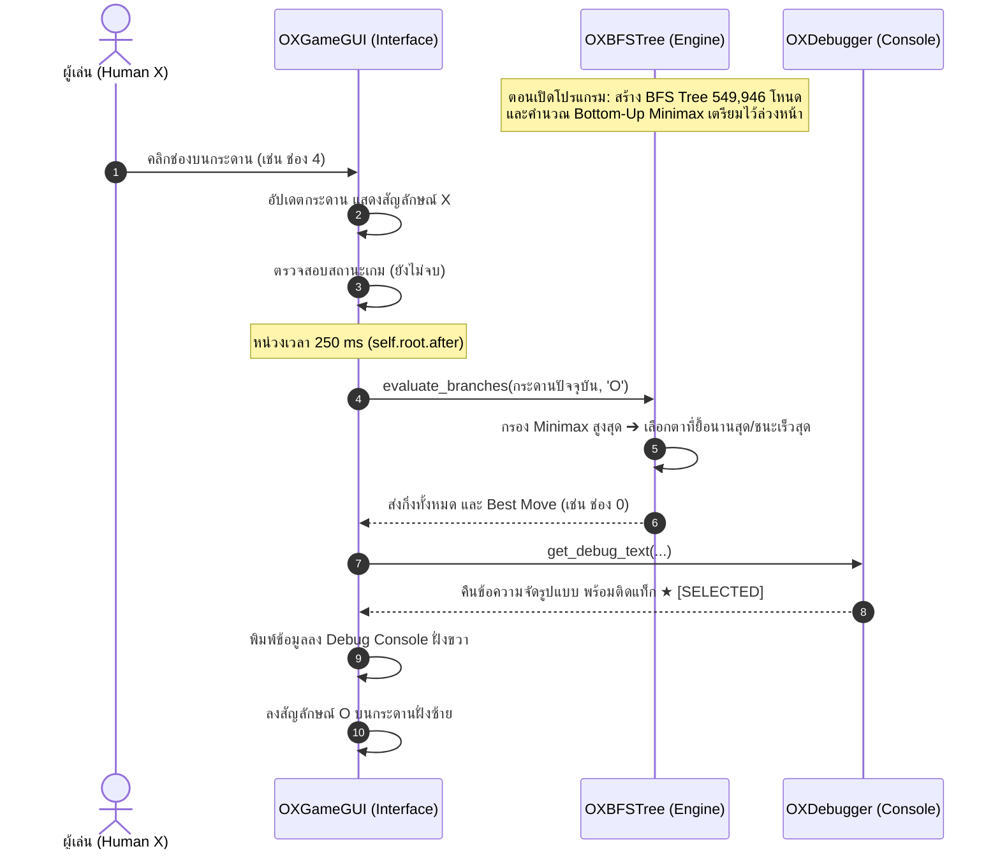

# คู่มือเอกสารโค้ดและเตรียมสอบตอบคำถาม: ระบบเกม OX (Tic-Tac-Toe BFS & Minimax)
> **เอกสารคู่มือเจาะลึกรายบรรทัด สำหรับอ่านทำความเข้าใจและเตรียมตอบคำถามในการสอบ (Code Walkthrough & Oral Defense Guide)**  
> อ้างอิงโค้ดจริงทั้งหมดจากไฟล์หลัก [`main.py`](main.py)

---

## สารบัญ (Table of Contents)
1. [โครงสร้างสถาปัตยกรรมใน main.py](#1-โครงสร้างสถาปัตยกรรมใน-mainpy)
2. [คลังคำถาม-คำตอบเจาะลึกในโค้ด: "อันนี้ใช้ทำอะไร?"](#2-คลังคำถาม-คำตอบเจาะลึกในโค้ด-อันนี้ใช้ทำอะไร)
   - [หมวดที่ 1: คลาส OXBoard (กฎและกระดาน)](#หมวดที่-1-คลาส-oxboard-กฎและกระดาน)
   - [หมวดที่ 2: คลาส GameNode (โครงสร้างข้อมูลโหนด)](#หมวดที่-2-คลาส-gamenode-โครงสร้างข้อมูลโหนด)
   - [หมวดที่ 3: คลาส OXBFSTree (การสร้างต้นไม้ BFS และคำนวณ Minimax)](#หมวดที่-3-คลาส-oxbfstree-การสร้างต้นไม้-bfs-และคำนวณ-minimax)
   - [หมวดที่ 4: คลาส OXDebugger (การจัดรูปแบบข้อมูลดีบัก)](#หมวดที่-4-คลาส-oxdebugger-การจัดรูปแบบข้อมูลดีบัก)
   - [หมวดที่ 5: คลาส OXGameGUI และจุดเริ่มรันโปรแกรม](#หมวดที่-5-คลาส-oxgamegui-และจุดเริ่มรันโปรแกรม)
3. [แผนภาพสรุปกระบวนการทำงานของระบบ (System Workflow)](#3-แผนภาพสรุปกระบวนการทำงานของระบบ)
4. [วิธีการเปิดใช้งาน (Execution)](#4-วิธีการเปิดใช้งาน)

---

## 1. โครงสร้างสถาปัตยกรรมใน main.py

ไฟล์ [`main.py`](main.py) รวมทุกส่วนประกอบไว้ในไฟล์เดียว โดยแบ่งหน้าที่ตามหลัก Single Responsibility Principle (SRP):

```
main.py
│
├── 1. class OXBoard        # จัดการกฎเกม, เส้นชัยชนะ 8 เส้น และการลงหมาก
├── 2. class GameNode       # โครงสร้างโหนดต้นไม้ เก็บสถานะกระดาน, ตาเดิน, ลูก และ Minimax
├── 3. class OXBFSTree     # สร้างต้นไม้ด้วยคิว BFS (5.4 แสนโหนด) และคำนวณ Minimax ย้อนกลับ
├── 4. class OXDebugger     # จัดรูปแบบข้อมูลสถานะและเรียงลำดับกิ่งที่ดีที่สุดเพื่อแสดงใน Debug
├── 5. class OXGameGUI      # หน้าต่างกราฟิก Tkinter และระบบควบคุมการเล่น
└── 6. if __name__ == '__main__': # จุดเริ่มต้นการทำงานของโปรแกรม
```

---

## 2. คลังคำถาม-คำตอบเจาะลึกในโค้ด: "อันนี้ใช้ทำอะไร?"

---

### หมวดที่ 1: คลาส `OXBoard` (กฎและกระดาน)

#### Q1.1: ทูเพิล `WINNING_COMBOS` เก็บอะไร และใช้ทำอะไร?
```python
WINNING_COMBOS = (
    (0, 1, 2), (3, 4, 5), (6, 7, 8),
    (0, 3, 6), (1, 4, 7), (2, 5, 8),
    (0, 4, 8), (2, 4, 6)
)
```
* **คำตอบ:** เก็บชุดดัชนีช่องบนกระดาน 9 ช่อง (0 ถึง 8) ของเส้นที่ทำให้ชนะเกมทั้ง 8 เส้นทาง ได้แก่:
  * แนวนอน 3 เส้น: `(0,1,2)`, `(3,4,5)`, `(6,7,8)`
  * แนวตั้ง 3 เส้น: `(0,3,6)`, `(1,4,7)`, `(2,5,8)`
  * ทแยงมุม 2 เส้น: `(0,4,8)`, `(2,4,6)`
* **ใช้ทำอะไร:** ใช้ในฟังก์ชัน `check_winner()` เพื่อวนลูปตรวจว่ามีผู้เล่นคนใดเรียงครบ 3 ช่องในเส้นเหล่านี้หรือไม่

---

#### Q1.2: ฟังก์ชัน `get_opponent(player)` ใช้ทำอะไร?
```python
@staticmethod
def get_opponent(player):
    if player == 'X':
        return 'O'
    return 'X'
```
* **คำตอบ:** ใช้สลับสัญลักษณ์ผู้เล่น เมื่อส่ง `'X'` เข้าไปจะได้ `'O'` และถ้าส่งตัวอื่นเข้ามาจะได้ `'X'` ใช้สำหรับเปลี่ยนตาเดินของผู้เล่นในแต่ละเทิร์น

---

#### Q1.3: ฟังก์ชัน `swap_symbols(board)` ใช้ทำอะไร? ทำไมต้องมี?
```python
@staticmethod
def swap_symbols(board):
    mapping = {'X': 'O', 'O': 'X', ' ': ' '}
    return "".join(mapping[char] for char in board)
```
* **คำตอบ:** ใช้สลับตัวอักษรทุกตัวในกระดาน โดยเปลี่ยน X เป็น O, เปลี่ยน O เป็น X และเว้นช่องว่าง `' '` ไว้เหมือนเดิม
* **ทำไมต้องมี:** ต้นไม้ Game Tree ถูกสร้างขึ้นโดยให้ X เดินก่อนเสมอ แต่ในการเล่นจริง AI อาจได้เล่นเป็น O (เดินที่สอง) การใช้ฟังก์ชันนี้สลับกระดานจะแปลงสถานะให้เทียบเคียงกับต้นไม้ที่สร้างไว้แล้วได้ทันที ทำให้ **ไม่ต้องสร้าง Game Tree ซ้ำซ้อน 2 ต้น** ประหยัดหน่วยความจำได้มหาศาล

---

#### Q1.4: บรรทัด `board[:position] + player + board[position + 1:]` ใน `place_symbol` ทำงานอย่างไร?
```python
@staticmethod
def place_symbol(board, position, player):
    return board[:position] + player + board[position + 1:]
```
* **คำตอบ:** เป็นการลงหมากบนกระดานด้วยเทคนิค **String Slicing**:
  1. `board[:position]`: ตัดเอาข้อความส่วนหน้าตั้งแต่ช่องแรกจนถึงก่อนตำแหน่งที่จะลง
  2. `+ player`: แทรกตัวอักษรของผู้เล่น (`'X'` หรือ `'O'`) ลงไปที่ตำแหน่ง `position`
  3. `+ board[position + 1:]`: ตัดเอาข้อความส่วนหลังตั้งแต่ถัดจากตำแหน่งนั้นไปจนจบกระดาน
* **ทำไมต้องเขียนแบบนี้:** เพราะ String ในภาษา Python เป็น Immutable (แก้ไขค่าในตัวอักษรเดิมไม่ได้ตรงๆ เหมือน List) จึงต้องตัดต่อเป็นสตริงใหม่ส่งกลับไป

---

#### Q1.5: ฟังก์ชัน `check_winner(board)` ทำงานอย่างไร?
```python
@staticmethod
def check_winner(board):
    for a, b, c in OXBoard.WINNING_COMBOS:
        if board[a] != ' ' and board[a] == board[b] == board[c]:
            return board[a]
    if ' ' not in board:
        return 'Draw'
    return None
```
* **คำตอบ:** 
  1. วนลูปหยิบดัชนี 3 ช่อง `a, b, c` จาก `WINNING_COMBOS`
  2. ตรวจสอบว่า `board[a] != ' '` (ช่องนั้นไม่ใช่ช่องว่าง) และ `board[a] == board[b] == board[c]` (ทั้งสามช่องมีตัวอักษรเหมือนกัน) ถ้าใช่ ให้ส่งตัวอักษรของผู้ชนะกลับไป (`'X'` หรือ `'O'`)
  3. ถ้าไม่มีใครเรียงครบ แต่ `' ' not in board` (ไม่มีช่องว่างเหลือแล้ว) ให้ส่ง `'Draw'` (เสมอ)
  4. ถ้ายังไม่มีใครชนะและยังมีช่องว่าง ให้ส่ง `None` (เกมยังไม่จบ)

---

### หมวดที่ 2: คลาส `GameNode` (โครงสร้างข้อมูลโหนด)

#### Q2.1: ตัวแปรแต่ละตัวใน `GameNode.__init__` เก็บอะไรและใช้ทำอะไร?
```python
class GameNode:
    def __init__(self, board, player_turn, move=None):
        self.board = board
        self.player_turn = player_turn
        self.move = move
        self.children = []
        self.winner = OXBoard.check_winner(board)
        self.is_terminal = (self.winner is not None)
        self.wins_x = 0
        self.wins_o = 0
        self.draws = 0
        self.minimax_val = None
        self.steps_to_end = 0
```
* **คำตอบ:**
  * `self.board`: สตริงความยาว 9 ตัวอักษร เก็บหน้าตากระดาน ณ โหนดนั้น
  * `self.player_turn`: ใครมีสิทธิ์เดินในตานี้ (`'X'` หรือ `'O'`)
  * `self.move`: ดัชนีช่อง (0–8) ที่เพิ่งเดินมาจากโหนดแม่จนเกิดเป็นโหนดนี้
  * `self.children`: ลิสต์เก็บโหนดลูกที่เป็นไปได้ทั้งหมดในตาถัดไป
  * `self.winner`: ผลการตรวจผู้ชนะ ณ โหนดนี้ (`'X'`, `'O'`, `'Draw'` หรือ `None`)
  * `self.is_terminal`: บูลีน (`True`/`False`) บอกว่าโหนดนี้คือจุดสิ้นสุดของเกมแล้วหรือไม่
  * `self.minimax_val`: ค่าประเมิน Minimax (`+1` = X ชนะ, `-1` = O ชนะ, `0` = เสมอ)
  * `self.steps_to_end`: จำนวนตาเดินจนกว่าเกมจะจบลงใต้กิ่งนี้ (ใช้หาตาที่ชนะเร็วที่สุด หรือยื้อเกมนานที่สุด)

---

### หมวดที่ 3: คลาส `OXBFSTree` (การสร้างต้นไม้ BFS และคำนวณ Minimax)

#### Q3.1: ตัวแปร `self.state_map` ใน `OXBFSTree` ใช้ทำอะไร?
```python
self.state_map = {}
...
self.state_map[(child.board, next_player)] = child
```
* **คำตอบ:** เป็น Dictionary (Hash Table) ที่จับคู่ระหว่างคีย์ `(board, player_turn)` กับ Object โหนดจริงในหน่วยความจำ
* **ใช้ทำอะไร:** ช่วยให้ตอนเล่นเกม AI สามารถค้นหาโหนดปัจจุบันได้ในเวลา $O(1)$ (ทันที) โดยไม่ต้องวนลูปค้นหาจากต้นไม้ทั้งหมด 549,946 โหนด
* **ทำไมคีย์ต้องมีทั้งกระดานและผู้เล่น:** เพราะกระดานหน้าตาเหมือนกัน แต่ถ้าตาเดินเป็นของคนละคน จะถือเป็นคนละสถานะกัน

---

#### Q3.2: ทำไมการสร้างต้นไม้ถึงใช้ `collections.deque` แทน List ธรรมดา?
```python
queue = deque([self.root])
...
node = queue.popleft()
```
* **คำตอบ:** เพราะ `deque` (Double-ended Queue) รองรับคำสั่ง `popleft()` เพื่อดึงตัวแรกออกจากคิวด้วยความเร็วคงที่ **$O(1)$** ขณะที่ List ธรรมดา `pop(0)` ต้องเลื่อนข้อมูลทั้งลิสต์ ใช้เวลา $O(N)$ ซึ่งจะทำให้การสร้าง 5.4 แสนโหนดช้าลงอย่างมาก

---

#### Q3.3: บรรทัด `if node.is_terminal: continue` มีไว้ทำอะไร?
* **คำตอบ:** เป็นเงื่อนไขตรวจสอบว่าถ้าโหนดนั้นจบเกมแล้ว (มีผู้ชนะหรือกระดานเต็ม) จะสั่ง `continue` เพื่อข้ามการแตกกิ่งลูก และไม่นำช่องว่างที่เหลือมาสร้างต่อ ป้องกันไม่ให้เดินต่อในเกมที่จบไปแล้ว

---

#### Q3.4: บรรทัด `for node in reversed(all_nodes):` ใช้ทำอะไร และทำไมต้อง `reversed`?
```python
for node in reversed(all_nodes):
    if node.is_terminal:
        ...
    else:
        ...
```
* **คำตอบ:** ใช้สำหรับขั้นตอน **Bottom-Up Minimax Backpropagation (คำนวณย้อนกลับจากล่างขึ้นบน)**
* **ทำไมต้อง `reversed`:** ตอนที่เราสร้างต้นไม้ด้วย BFS คิวจะเก็บโหนดแม่ลงใน `all_nodes` ก่อนโหนดลูกเสมอ ดังนั้นเมื่อวนลูปแบบย้อนกลับ (`reversed`) จะการันตีว่า **โหนดลูกทุกโหนดจะถูกคำนวณเสร็จก่อนโหนดแม่เสมอ 100%** ทำให้คำนวณ Minimax ได้ครบทั้งต้นไม้ในลูปเดียว โดยไม่ต้องเขียนฟังก์ชัน Recursive ซ้อนกันให้เสี่ยงต่อ Stack Overflow

---

#### Q3.5: บรรทัดคำนวณ Minimax ทำไมตา X ใช้ `max(vals)` แต่ตา O ใช้ `min(vals)`?
```python
vals = [child.minimax_val for child in node.children]
if node.player_turn == 'X':
    best_val = max(vals)
else:
    best_val = min(vals)
```
* **คำตอบ:** 
  * ในระบบนี้ เรานิยามให้คะแนนสูงสุดคือ X ชนะ (`+1`) และคะแนนต่ำสุดคือ O ชนะ (`-1`)
  * ในตาของ X: X ย่อมต้องการให้ตัวเองชนะ จึงเป็น Maximizer ที่เลือกค่าสูงสุด (`max`)
  * ในตาของ O: O ย่อมต้องการให้ตัวเองชนะ (ซึ่งคือค่า -1) จึงเป็น Minimizer ที่เลือกค่าต่ำสุด (`min`)

---

#### Q3.6: บรรทัด `is_winning` และ `is_losing` ทำงานอย่างไร? ทำไมต้อง `+ 1` ใน `steps_to_end`?
```python
if is_winning:
    node.steps_to_end = min(child.steps_to_end for child in best_children) + 1
elif is_losing:
    node.steps_to_end = max(child.steps_to_end for child in best_children) + 1
else:
    node.steps_to_end = min(child.steps_to_end for child in best_children) + 1
```
* **คำตอบ:** 
  * **ตอนชนะ (`is_winning`):** ผู้เล่นย่อมต้องการชนะให้เร็วที่สุด จึงเลือกกิ่งลูกที่มี $\min(\text{steps})$ (Fastest Win)
  * **ตอนแพ้ (`is_losing`):** ผู้เล่นย่อมต้องการยื้อเกมให้นานที่สุด จึงเลือกกิ่งลูกที่มี $\max(\text{steps})$ (Delay Defeat) เพื่อรอจังหวะคู่แข่งเดินพลาด
  * **ทำไมต้อง `+ 1`:** เพราะการเดินจากโหนดแม่ลงไปยังโหนดลูก ถือว่าใช้ตาเดินเพิ่มขึ้น 1 ก้าวเสมอ

---

#### Q3.7: ใน `evaluate_branches` บรรทัด `val = -child.minimax_val` ทำไมต้องใส่เครื่องหมายลบ?
```python
if is_swapped or current_player == 'X':
    val = child.minimax_val
else:
    val = -child.minimax_val
```
* **คำตอบ:** เพื่อปรับค่าคะแนนให้อยู่ใน **มุมมองของผู้เล่นปัจจุบันเสมอ (Normalized Value)**:
  * ในต้นไม้ ค่า `+1` คือ X ชนะ และ `-1` คือ O ชนะ
  * หากปัจจุบันเป็นตาของ O การที่ O ชนะในต้นไม้คือ `-1` เมื่อใส่เครื่องหมายลบ `-(-1)` จะกลายเป็น `+1`
  * ผลลัพธ์คือ ไม่ว่าจะเป็นตาของ X หรือ O ค่า `+1` จะหมายถึง "ฉันชนะ" และ `-1` หมายถึง "ฉันแพ้" เสมอ ทำให้เขียนโค้ดตัดสินใจได้ง่ายโดยไม่ต้องแยกเงื่อนไข

---

#### Q3.8: การตัดสินใจเลือกตาเดินใน `evaluate_branches` ทำงานอย่างไร?
```python
best_minimax = max(branch['minimax_val'] for branch in branches)
best_candidates = [branch for branch in branches if branch['minimax_val'] == best_minimax]
if best_minimax == 1:
    min_steps = min(branch['steps'] for branch in best_candidates)
    for branch in best_candidates:
        if branch['steps'] == min_steps:
            best_move = branch['move']
            break
elif best_minimax == -1:
    max_steps = max(branch['steps'] for branch in best_candidates)
    for branch in best_candidates:
        if branch['steps'] == max_steps:
            best_move = branch['move']
            break
else:
    best_move = best_candidates[0]['move']
return branches, best_move
```
* **คำตอบ:** มี 2 ขั้นตอน:
  1. **กรองกิ่งที่ดีที่สุด:** หาค่า Minimax สูงสุด (`best_minimax`) แล้วคัดกิ่งที่มีค่าเท่ากันไว้ใน `best_candidates`
  2. **ตัดสินด้วยจำนวนก้าวเดิน:**
     * ถ้าการันตีชนะ (`best_minimax == 1`): หา `min_steps` เพื่อเลือกช่องที่ **ชนะเร็วที่สุด** (หากมีช่องชนะทันที `steps = 1` จะถูกเลือกเดินทันที)
     * ถ้าการันตีแพ้ (`best_minimax == -1`): หา `max_steps` เพื่อเลือกช่องที่ **ยื้อเกมนานที่สุด** (จะบล็อกตาชนะของคู่แข่งโดยอัตโนมัติ)
     * ถ้าเสมอ (`best_minimax == 0`): เลือกเดินช่องแรกในกลุ่มที่การันตีผลเสมอ

---

### หมวดที่ 4: คลาส `OXDebugger` (การจัดรูปแบบข้อมูลดีบัก)

#### Q4.1: ฟังก์ชัน `branch_sort_key(branch)` มีไว้ทำอะไร? ทำไมตอนชนะ `step_priority` ต้องติดลบ?
```python
def branch_sort_key(branch):
    if branch['minimax_val'] == 1:
        step_priority = -branch['steps']
    elif branch['minimax_val'] == -1:
        step_priority = branch['steps']
    else:
        step_priority = 0
    return (branch['minimax_val'], step_priority)
```
* **คำตอบ:** ใช้กำหนดลำดับความสำคัญในการจัดเรียงกิ่งที่จะแสดงใน Debug Console โดยเรียงจากมากไปน้อย (`reverse=True`):
  1. ดู `minimax_val` ก่อน (`+1` มาก่อน `0` และ `-1`)
  2. หากคะแนนเท่ากัน จะดู `step_priority`:
     * ตอนชนะ (`+1`): เราต้องการก้าวเดินน้อยที่สุด (เช่น 1 ตา ดีกว่า 3 ตา) เมื่อใส่เครื่องหมายลบ `-1` จะมีค่ามากกว่า `-3` ทำให้ **กิ่งที่ชนะใน 1 ตา ถูกจัดขึ้นมาอยู่อันดับ 1 เสมอ**
     * ตอนแพ้ (`-1`): เราต้องการก้าวเดินมากที่สุด (ยื้อนานสุด) ค่า `5` มากกว่า `2` กิ่งที่ยื้อได้ 5 ตาจึงขึ้นก่อน

---

#### Q4.2: ฟังก์ชัน `format_row(board, start_index)` ทำงานอย่างไร?
```python
@staticmethod
def format_row(board, start_index):
    cells = [char if char != ' ' else '.' for char in board[start_index:start_index + 3]]
    return " | ".join(cells)
```
* **คำตอบ:** ใช้แปลงตัวอักษร 3 ตัวในแต่ละแถวของกระดานให้แสดงผลสวยงาม:
  * ตัดสตริงทีละ 3 ช่อง: `board[start_index:start_index + 3]`
  * หากช่องนั้นเป็นช่องว่าง `' '` ให้เปลี่ยนเป็นจุด `.` เพื่อให้อ่านง่าย
  * นำมาเชื่อมกันด้วย `" | "` เช่น `'X | . | O'`

---

### หมวดที่ 5: คลาส `OXGameGUI` และจุดเริ่มรันโปรแกรม

#### Q5.1: คำสั่ง `self.root.after(250, self._ai_turn)` ใช้ทำอะไร? ทำไมต้องหน่วงเวลา 250 มิลลิวินาที?
```python
self.ai_job = self.root.after(250, self._ai_turn)
```
* **คำตอบ:** เป็นคำสั่งของ Tkinter ที่ใช้ตั้งเวลาให้เรียกฟังก์ชัน `_ai_turn` (ตาเดินของ AI) หลังจากผ่านไป 250 มิลลิวินาที
* **ทำไมต้องหน่วงเวลา:** เพื่อให้หน้าจอ GUI มีเวลาเรนเดอร์สัญลักษณ์ที่ผู้เล่นมนุษย์เพิ่งคลิกเสร็จเรียบร้อยก่อน และให้ความรู้สึกเป็นธรรมชาติว่าบอทกำลังคิด หากไม่หน่วงเวลา บอทจะเดินเสร็จในเสี้ยววินาทีจนตาผู้เล่นมองตามไม่ทัน

---

#### Q5.2: บรรทัด `command=lambda idx=i: self._on_cell_clicked(idx)` ทำไมต้องใส่ `idx=i`?
```python
for i in range(9):
    btn = tk.Button(
        ...
        command=lambda idx=i: self._on_cell_clicked(idx)
    )
```
* **คำตอบ:** เป็นเทคนิค **Default Argument Binding** เพื่อล็อคค่าดัชนีช่อง `i` ประจำแต่ละปุ่มไว้ทันทีในรอบลูปนั้นๆ
* **ถ้าไม่ใส่ `idx=i` จะเกิดอะไรขึ้น:** ฟังก์ชัน `lambda` จะไปดึงค่าตัวแปร `i` ตัวสุดท้ายเมื่อลูปทำงานเสร็จ (ซึ่งคือเลข 8) ทำให้ไม่ว่าจะคลิกปุ่มช่องไหน กลายเป็นกดช่องที่ 8 เหมือนกันหมด

---

#### Q5.3: คำสั่ง `SetCurrentProcessExplicitAppUserModelID` ก่อน `tk.Tk()` มีไว้ทำอะไร?
```python
try:
    myappid = 'oxbfs.tictactoe.game.v1'
    ctypes.windll.shell32.SetCurrentProcessExplicitAppUserModelID(myappid)
except Exception:
    pass
```
* **คำตอบ:** ใช้สำหรับแก้ไขปัญหา **ไอคอนรูปขนนก (Tkinter Feather)** บนแถบ Windows Taskbar:
  * โดยปกติ Windows จะจัดกลุ่มโปรแกรม Python ทุกโปรแกรมรวมไว้ใต้ `python.exe` เดียวกัน และดึงไอคอนตั้งต้นของระบบ (รูปขนนก) มาแสดง
  * คำสั่งนี้เป็นการลงทะเบียน Application User Model ID (AUMID) เฉพาะของโปรแกรม เพื่อบอก Windows Shell ว่านี่คือแอปพลิเคชันเดี่ยวแยกต่างหาก
  * **สำคัญมาก:** คำสั่งนี้ **ต้องทำงานก่อนสร้างหน้าต่าง `tk.Tk()`** เพื่อให้ Windows ผูกหน้าต่างและ Taskbar เข้ากับ App ID นี้ตั้งแต่ต้น ทำให้แสดงไอคอนเกมที่เราตั้งไว้ทั้งบน Title Bar และ Taskbar ได้สมบูรณ์

---

#### Q5.4: บรรทัด `if __name__ == '__main__':` มีไว้ทำอะไร?
```python
if __name__ == '__main__':
    try:
        myappid = 'oxbfs.tictactoe.game.v1'
        ctypes.windll.shell32.SetCurrentProcessExplicitAppUserModelID(myappid)
    except Exception:
        pass

    root = tk.Tk()
    app = OXGameGUI(root)
    root.mainloop()
```
* **คำตอบ:** ใช้ตรวจสอบว่าไฟล์นี้ถูกเรียกสั่งรันโดยตรงหรือไม่ (เช่น พิมพ์ `python main.py`)
  * ถ้ารันโดยตรง: ตัวแปร `__name__` จะมีค่าเป็น `'__main__'` บล็อกคำสั่งนี้จะทำงาน เปิดหน้าต่าง GUI ขึ้นมาเล่นเกม
  * ถ้าถูกไฟล์อื่น `import main`: คำสั่งในบล็อกนี้จะไม่ถูกรัน ทำให้สามารถนำคลาสในไฟล์นี้ไปเขียนทดสอบ (Unit Test) ได้โดยไม่เผลอเปิดหน้าต่างเกมขึ้นมา

---

## 3. แผนภาพสรุปกระบวนการทำงานของระบบ


```mermaid
sequenceDiagram
    autonumber
    actor Player as ผู้เล่น (Human X)
    participant GUI as OXGameGUI (Interface)
    participant Tree as OXBFSTree (Engine)
    participant Debug as OXDebugger (Console)

    Note over Tree: ตอนเปิดโปรแกรม: สร้าง BFS Tree 549,946 โหนด<br/>และคำนวณ Bottom-Up Minimax เตรียมไว้ล่วงหน้า
    Player->>GUI: คลิกช่องบนกระดาน (เช่น ช่อง 4)
    GUI->>GUI: อัปเดตกระดาน แสดงสัญลักษณ์ X
    GUI->>GUI: ตรวจสอบสถานะเกม (ยังไม่จบ)
    Note over GUI: หน่วงเวลา 250 ms (self.root.after)
    GUI->>Tree: evaluate_branches(กระดานปัจจุบัน, 'O')
    Tree->>Tree: กรอง Minimax สูงสุด ➔ เลือกตาที่ยื้อนานสุด/ชนะเร็วสุด
    Tree-->>GUI: ส่งกิ่งทั้งหมด และ Best Move (เช่น ช่อง 0)
    GUI->>Debug: get_debug_text(...)
    Debug-->>GUI: คืนข้อความจัดรูปแบบ พร้อมติดแท็ก ★ [SELECTED]
    GUI->>GUI: พิมพ์ข้อมูลลง Debug Console ฝั่งขวา
    GUI->>GUI: ลงสัญลักษณ์ O บนกระดานฝั่งซ้าย
```

---

## 4. วิธีการเปิดใช้งาน

รันโปรแกรมผ่าน Terminal หรือ PowerShell:

```bash
python main.py
```
*(ต้องการเพียง Python 3.8 ขึ้นไป โดยไม่ต้องติดตั้งโมดูลภายนอก)*
